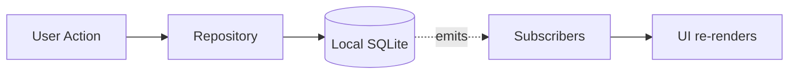

# Nex — Development Guide

> Write code like the product feels: simple, fast, reliable, and free of unnecessary ceremony. Pairs with [`04-architecture.md`](./04-architecture.md) (the *what/why*) and [`07-contributing.md`](./07-contributing.md) (the *process*).

**Status:** Authoritative · **Owner:** Engineering · **Last updated:** 2026

---

## Coding Principles

1. **Optimize for capture-path latency above all else.** Any change touching the capture flow must be measured against the engineering performance budget (see [`02-product-specification.md`](./02-product-specification.md#non-functional-requirements)) before merge.
2. **Prefer boring, proven technology.** Nex's value is in restraint, not novelty — this applies to code as much as to product surface.
3. **No speculative abstraction.** Don't build configurability, plugin systems, or generic frameworks for requirements that don't exist yet (e.g., don't pre-build a "file attachment" abstraction ahead of its v2 scope).
4. **Local-first is a hard constraint, not an implementation detail.** Every feature must work fully offline unless it is explicitly, unavoidably a network feature (sync itself, AI transcription).
5. **AI code paths must be structurally optional.** Any AI-layer integration must be behind an interface that can be no-op'd or removed without touching Core or UI layers.
6. **Small, composable modules over large, stateful ones.** Favor pure functions in Core; keep side effects (storage, network, media I/O) isolated at the edges (Data layer).
7. **Every non-negotiable principle in the [Vision doc](./01-product-vision.md#non-negotiable-principles) is a code review gate**, not just a design guideline.

---

## Folder Structure

The structure mirrors the architecture layers, and is organized as a monorepo so that the mobile, desktop, and backend shells share one Core and Data layer — required for a genuinely cross-platform, sync-ready product from day one.

```
nex/
├── apps/
│   ├── mobile/                  # React Native app shell (Android, future iOS)
│   │   ├── src/
│   │   │   ├── screens/         # Timeline, Capture, Search, NoteDetail
│   │   │   ├── navigation/
│   │   │   └── platform/        # native module bridges (camera, mic, filesystem)
│   │   └── ...
│   ├── desktop/                  # Tauri/Electron app shell (Windows)
│   │   ├── src/
│   │   │   ├── screens/
│   │   │   └── platform/
│   │   └── ...
│   └── backend/                  # Minimal Node.js + PostgreSQL sync API
│       ├── src/
│       │   ├── routes/           # notes, tags, sync
│       │   ├── db/                # schema + migrations
│       │   └── services/
│       └── ...
├── packages/
│   ├── core/                     # Platform-agnostic domain logic
│   │   ├── capture/
│   │   ├── search/
│   │   ├── tags/
│   │   └── sync/                 # conflict resolution: LWW for scalars, union-merge for tags
│   ├── data/                     # Local-first storage layer
│   │   ├── schema/                # note.id: UUIDv7, rev, media_hash, deleted_at
│   │   ├── repositories/
│   │   └── sync-client/
│   ├── ui/                       # Shared design system components
│   │   ├── components/
│   │   └── tokens/                 # colors, typography, spacing — see 05-design.md
│   └── ai/                       # Optional AI adapters (v3+) — never imported by capture
│       ├── transcription/
│       ├── ocr/
│       └── tagging/
├── docs/                          # This documentation set
└── README.md
```

Each `packages/*` module is independently unit-testable and has no dependency on any `apps/*` shell. **Dependency rule:** `apps/* → packages/core → packages/data`. `packages/ai` and the sync client are optional leaves — nothing in the capture path may import them.

---

## Naming Conventions

| Element | Convention | Example |
|---|---|---|
| Files (components) | `PascalCase.tsx` | `NoteCard.tsx` |
| Files (logic/modules) | `kebab-case.ts` | `note-repository.ts` |
| Components | `PascalCase` | `NoteCard`, `CaptureSheet` |
| Functions/variables | `camelCase` | `submitCapture`, `createdAt` |
| Types/interfaces | `PascalCase`, no `I` prefix | `Note`, `SearchFilters` |
| Constants | `UPPER_SNAKE_CASE` for true constants | `MAX_TAG_LENGTH` |
| Database columns | `snake_case` | `created_at`, `media_hash` |
| Branches | `type/short-description` | `feat/voice-capture-waveform`, `fix/search-date-filter-timezone` |
| Commits | [Conventional Commits](https://www.conventionalcommits.org/) | `feat:`, `fix:`, `perf:`, `refactor:`, `test:`, `docs:`, `chore:` |

Be consistent within a file and descriptive over abbreviated: `createdAt` beats `ca`.

---

## State Management Recommendation

Nex's state needs are intentionally modest.

- **Persisted domain state** (notes, tags): owned by the **Data layer** (SQLite-backed repositories), exposed to the UI via reactive subscriptions — the Timeline updates automatically as the local store changes, including from background sync writes.
- **Local, ephemeral UI state** (capture sheet open/closed, in-progress text before persistence, active search filters): component-local state. No global state library is needed for v1 — a large, generalized framework would be over-engineering relative to the product's scope.
- **Explicit rule:** state management choices must never introduce a delay between "user provided content" and "content is durably saved." Any layer between UI and Data must be write-through, not write-behind, for capture actions.



---

## AI Adapter Interface

AI integrations live entirely in `packages/ai` and are consumed by Core through a single provider-agnostic interface. This is the concrete, code-level expression of "AI is optional and swappable" — Core calls the interface, never a specific vendor SDK, and every method is optional so an adapter may implement any subset of capabilities:

```typescript
interface AIAdapter {
  transcribe?(audio: AudioRef): Promise<Transcript>
  embed?(text: string): Promise<Vector>
  suggestTags?(note: Note): Promise<Tag[]>
  summarize?(note: Note): Promise<Summary>
  ocr?(image: ImageRef): Promise<OCRText>
}
```

- Missing capabilities are simply unavailable, not errors — Core degrades gracefully.
- Swapping a model or provider must not touch domain, storage, or UI code.
- Default to on-device implementations where feasible; any cloud-backed implementation is opt-in per the [AI Strategy](./09-ai.md).

---

## Error Handling

- **Capture must never surface a blocking error to the user.** If local persistence fails, the UI retries transparently and only surfaces a non-blocking, dismissible notice if content genuinely could not be saved — never a modal that halts the flow.
- **Fail closed on ambiguity for writes; fail open for reads.** A failed search returns an empty result with a message, not a crash.
- **Typed domain errors** (`CaptureFailed`, `SearchUnavailable`, `SyncConflict`) instead of raw strings or leaked DB/network exceptions — the UI never sees implementation-level errors.
- **Network and sync errors are silent by default,** logged and retried with backoff; they never interrupt the user's current screen or task.
- **AI errors are always non-blocking and reversible.** A failed transcription, OCR pass, or tag suggestion simply leaves the note in its prior state.
- **Fail loudly in development, fail quietly in production.**

---

## Logging

- **Structured logging only** — every entry is a structured object (level, module, message, context), never a free-form string.
- **Levels:** `debug` (dev only), `info` (lifecycle events), `warn` (recoverable issues), `error` (unexpected failures).
- **No content logging, ever.** Note content, tags, and media are never written to logs, locally or remotely — a privacy requirement, not a style preference (see [`09-ai.md`](./09-ai.md)).
- **Client-side logs stay local** by default; opt-in diagnostic sharing, if ever introduced, must be explicit, scoped, and time-limited.
- **Backend logs** (v2+) are centralized for operational monitoring (error rates, sync latency, API availability) but exclude request bodies containing user content.

---

## Testing Strategy

Testing effort is weighted toward the parts of the system where a regression most directly breaks the product's core promise.

| Layer | Test Type | Priority |
|---|---|---|
| Core domain (capture, search, tags, sync orchestration incl. tag union-merge) | Unit tests, high coverage | Highest |
| Data layer (repositories, schema, sync client) | Integration tests against a real local SQLite instance | Critical — persistence correctness is non-negotiable |
| Capture flow | E2E: open → capture → persisted → on Timeline, under budget | Critical — this is literally the product's promise |
| Search | Tests for text, tag, date, and type filters + ranking | High |
| Sync (v2) | Conflict-resolution tests: scalar LWW, tag union-merge, tombstones, media dedupe by `media_hash` | High once sync ships |
| UI components | Render, tap, assert state; accessibility, keyboard, reduced-motion | Medium |
| Performance | Automated timing assertions on capture-to-save and query-to-result | High — regressions here are regressions of the core value proposition, gated in CI |

CI gates on: unit + integration test suites, capture/search performance budgets, and lint/type-check passing. No feature merges if it regresses the capture or find performance budget.

---

## Git Workflow

- **Trunk-based development** on `main`, with short-lived feature branches (`type/short-description`).
- **Pull requests required** for all changes; at least one review approval before merge.
- **CI must pass** (typecheck, lint, unit/integration tests, performance budget checks) before merge.
- **Squash-merge** to keep `main` history linear, with a Conventional Commits-formatted message.
- **Releases are tagged** (`vMAJOR.MINOR.PATCH`); sync-contract changes are `MAJOR`.
- **No direct commits to `main`**, including for documentation.

See [`07-contributing.md`](./07-contributing.md) for the contributor workflow.
