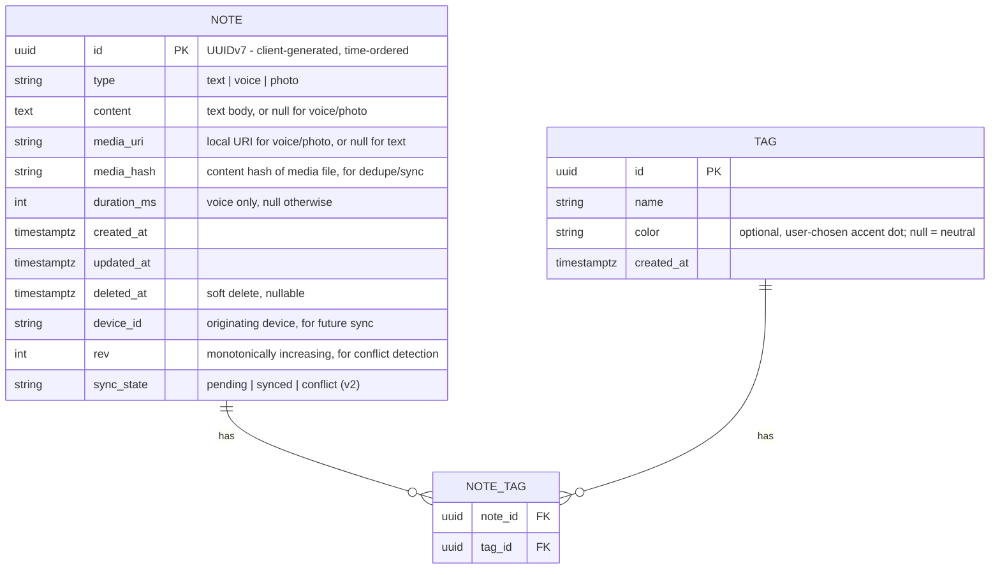

# Nex — Product Specification

> Companion to [`01-product-vision.md`](./01-product-vision.md). The vision defines *why*; this document defines *what* is being built.

**Status:** Authoritative · **Owner:** Product · **Last updated:** 2026

---

## Product Overview

Nex is a cross-platform capture application built around a single timeline of notes. A note is text, a voice recording, or a photo. Every note is created through one universal `+` action, saved automatically, and immediately returned to the timeline. Organization (tags) is optional and always applied after capture. Search operates on text content, tags, dates, and content type.

---

## Goals

- Make capture feel instantaneous to the user (< 3 s, the product promise — see [`01-product-vision.md`](./01-product-vision.md#non-negotiable-principles)).
- Make finding a previously captured note feel instantaneous to the user (< 3 s).
- Provide a single, chronological home (the Timeline) with no default folders.
- Support three capture types in v1: text, voice, photo.
- Provide lightweight, fully optional organization via tags.
- Lay a local-first data architecture that supports future sync **without a rewrite**.

## Non-Goals

- Rich text editing, nested documents, or databases.
- Task/project management.
- Multi-user collaboration or shared workspaces.
- A generic file attachment type (deferred to v2).
- Full cross-device sync (architected for in v1, delivered in v2).
- Speech-to-text and OCR (delivered in v3).

---

## MVP Scope

| In Scope (v1) | Out of Scope (v1) |
|---|---|
| Timeline home screen | Default/system folders |
| Text capture | Rich text formatting |
| Voice capture | Speech-to-text transcription |
| Photo capture (camera + gallery) | Generic file attachments |
| Auto-save, no Save button | Manual save / drafts |
| Tags (optional, freeform) | Nested tags / tag hierarchies |
| Search by text, tag, date | Semantic / AI-powered search |
| Content-type filter (layered onto search) | Content-type as a separate search mode |
| Local-first storage, sync-ready schema | Real multi-device sync |
| **Manual data export** (JSON + Markdown + media) | — |
| **Automatic local backup + one-tap restore** | — |
| **Home-screen widget + Android share-intent capture** (v1.x) | Desktop global hotkey / system tray (future) |

---

## User Stories

1. As a user, I can tap `+` and immediately type a text note so it is saved with no extra steps.
2. As a user, I can start recording audio with a single tap so I capture a spoken idea instantly.
3. As a user, I can snap a photo or pick one from my gallery in two taps.
4. As a user, my note is saved automatically — I never see a Save button.
5. As a user, I return straight to the timeline after capturing.
6. As a user, I see my notes newest-first in a single timeline.
7. As a user, I can optionally add one or more tags to a note, at any time, never as a precondition.
8. As a user, I can search text notes by keyword, and filter by tag, date, and content type.
9. As a user, I understand that voice notes are found by tag/date rather than keyword in v1, so I don't form the wrong expectation of search.
10. As a user, the app works fully offline for every core flow.

---

## Functional Requirements

### FR-1 — Capture
- FR-1.1 A persistent `+` action is reachable from the Timeline in one tap.
- FR-1.2 Tapping `+` opens a capture bottom sheet with a text field immediately focused and ready to type (Text is the default, immediate mode — not one of several equal menu choices). Inline controls on the same sheet switch into Voice, Photo, or File capture. See [`mockup.html`](./mockup.html) and [`05-design.md`](./05-design.md) — the mockup is authoritative for this interaction.
- FR-1.3 The capture sheet’s text field is empty and keyboard-focused on open; the first character begins an auto-saved text note (FR-1.7).
- FR-1.4 **Voice** (from the capture sheet) starts recording immediately — no intermediate "press to start" step.
- FR-1.5 **Photo** (from the capture sheet) opens the camera immediately, with an explicit option to switch to gallery.
- FR-1.6 No field is ever mandatory. Title, tags, and folders are never requested during capture.
- FR-1.7 A note is saved automatically as soon as it has content (first character, recording stopped, photo confirmed) — there is no explicit save action.
- FR-1.8 After saving, the user returns directly to the Timeline with the new note at the top.
- FR-1.9 Canceling an empty capture discards it silently, with no confirmation dialog.

### FR-2 — Timeline
- FR-2.1 The Timeline is the default/home screen on launch.
- FR-2.2 Notes are ordered reverse-chronologically.
- FR-2.3 Each note renders as a minimal card: content preview, timestamp, tags (if any).
- FR-2.4 No default folders, sections, or pre-existing categories.
- FR-2.5 Smooth infinite scroll/pagination for large note counts.
- FR-2.6 Each Timeline card supports two swipe gestures — one revealing a **leading-edge** action, one revealing a **trailing-edge** action. The default mapping is: trailing swipe → **Delete** (soft-delete, undoable); leading swipe → **Add Tag** (opens inline tag input). No confirmation dialog interrupts either action; Delete surfaces a brief, dismissible "Undo" toast instead.
- FR-2.7 Each edge is bound **independently** to an action, chosen in Settings from the actions that exist — currently **Delete**, **Add Tag** and **None**. The edges are not coupled: both may carry the same action, and an edge set to None does not respond to a swipe at all. The set is open, so a new action is an addition rather than a redesign — see [ADR-022](./10-decisions.md#adr-022--swipe-actions-are-configurable-per-edge-from-an-open-set).
- FR-2.8 Swipe actions never introduce a decision at capture time — they operate only on already-captured notes in the Timeline, consistent with [ADR-001](./10-decisions.md#adr-001--capture-has-zero-mandatory-fields).
- FR-2.9 Tapping a card opens the Note Detail Sheet, which offers the actions that are not worth a gesture: open, share, copy, edit, caption, add tag, summarize, details, delete.
- FR-2.9.1 The sheet's height follows the note. A long note opens at reading height — roughly two thirds of the screen — and scrolls for as long as it runs; a two-line thought stays a two-line sheet. Reading a captured note must not begin with dragging the sheet upward.
- FR-2.9.2 The actions are pinned below the body rather than placed at the end of it, so a screenful of text never buries them. Text is laid out for reading at length: looser leading than a timeline card, and the paragraph's own direction (RTL or LTR) rather than the interface's.
- FR-2.10 The body of a **text** note is editable after capture. This is correcting a capture, not authoring: it is plain text with no formatting, no title and no versioning, and it never appears during capture (FR-1.6). Media notes are not editable — their caption is the equivalent affordance (FR-2.11). Rich text, nested documents and revision history stay out of scope.
- FR-2.11 A voice, photo or file note may carry an optional user-written **caption**. It is always optional, never requested at capture time, and is distinct from a machine-derived transcript, OCR text or summary — those are produced by the intelligence layer (see [AI Roadmap](#ai-roadmap)) and never overwrite what the user typed. Caption text is not full-text indexed in v1, matching FR-4.2.

### FR-3 — Tags
- FR-3.1 Tags are entirely optional on every note type.
- FR-3.2 Tags can be added or removed at any time after capture, including via the swipe-to-tag action (FR-2.6).
- FR-3.3 Tags are freeform strings (no required taxonomy); common suggestions (`Idea`, `Work`, `Shopping`, `Learning`, `Inspiration`) are offered for discoverability.
- FR-3.4 A note may have zero, one, or multiple tags.
- FR-3.5 A tag may optionally carry one accent color, chosen by the user from a small fixed palette when creating or editing the tag; unset tags render with no color (neutral). Color is never requested or required during capture — see [`05-design.md`](./05-design.md#tag-accent-color) and [ADR-021](./10-decisions.md#adr-021--optional-user-chosen-tag-accent-color).

### FR-4 — Search
- FR-4.1 A persistent search entry point is reachable from the Timeline in one tap.
- FR-4.2 Full-text search runs against text-note content.
- FR-4.3 Search supports filtering by one or more tags.
- FR-4.4 Search supports filtering by date or date range.
- FR-4.5 Search supports filtering by content type, as an additional filter layered on top of tag/date search — not a separate search mode.
- FR-4.6 Voice notes are excluded from full-text matching in v1/v2 (no transcript exists) and are discoverable only via tag/date/type filters. The UI labels each voice note, e.g. *"Searchable by tag/date only"*.
- FR-4.7 Search results update incrementally as the user types.

### FR-5 — Data Integrity, Offline, and Sync-Readiness
- FR-5.1 The app is fully functional offline for capture, browsing, tagging, and search.
- FR-5.2 Every note is assigned a **client-generated UUIDv7** and `created_at` / `updated_at` timestamps at creation time, regardless of sync status. UUIDv7 is used specifically (rather than UUIDv4 or an auto-increment key) because it is time-ordered: it sorts naturally by creation time, which matches the Timeline's primary access pattern and keeps database indexes efficient at scale — see [ADR-018](./10-decisions.md#adr-018--uuidv7-as-the-note-identifier).
- FR-5.3 Every note carries a monotonic `rev` (revision counter) and a soft-delete `deleted_at` tombstone from v1, even though sync is inactive until v2.
- FR-5.4 Media notes (voice, photo) carry a `media_hash` — a content hash of the underlying file — computed at capture time, so that identical media captured or re-synced from multiple devices can be deduplicated without a network round trip. See [ADR-019](./10-decisions.md#adr-019--content-addressed-media-for-dedupe).
- FR-5.5 No user action should ever produce data loss under normal operation (app kill, restart, low storage excluded).

### FR-6 — Export
- FR-6.1 A **Settings → Data & backup → Export** action produces, in one tap, a JSON dump of all notes and tags (full fidelity, machine-readable) and a Markdown export (one file per note, human-readable), plus the referenced media files, bundled into a single archive.
- FR-6.1.1 The archive is handed to the platform share sheet, so the user chooses where it goes — another app, a cloud drive, a cable. It is never left at a path the user cannot reach: on a phone, a file written to a private temp directory is not an export at all.
- FR-6.1.2 An **Import** action reads an export archive back into the library, with its media. Import is *additive*: a note whose id is already present is left untouched rather than overwritten, so importing the same archive twice is a no-op and an old archive can never roll a newer note back. Notes whose media is missing from the archive are still imported. A file that is not a Nex export is refused without writing anything.
- FR-6.2 Export never requires network access — it is a fully local, offline operation.
- FR-6.3 A round-trip check (export, then verify the archive's content matches the source data) is part of the v1.0 release exit criteria — see [ADR-025](./10-decisions.md#adr-025--data-export-ships-in-v1-not-after-v3).

### FR-7 — Backup & Restore
- FR-7.1 The app automatically maintains a small, fixed number of rotating local backups of the SQLite database, on-device, with no user action required to create them.
- FR-7.2 Every backup on the device is listed with its date and size, and any one of them can be restored — not only the newest, which is also the one most likely to contain a mistake just made. A **Back up now** action takes one outside the daily schedule.
- FR-7.4 Local backups protect against a bad restore or a corrupted database. They do **not** protect against a lost device, because they live on it; the UI says so, and points at export for that.
- FR-7.3 Backup/restore correctness is verified in testing against a simulated database-corruption scenario, per [ADR-026](./10-decisions.md#adr-026--automatic-local-backup--restore-ships-in-v1).

### FR-8b — AI Provider

- FR-8b.1 The intelligence features run on-device by default. On-device means local heuristics, not a local model: they can suggest tags from a note's own words, and nothing more.
- FR-8b.2 A user may point Nex at **Google Gemini, Anthropic, OpenAI, OpenRouter, or a custom OpenAI-compatible endpoint**, supplying an API key, an optional base URL and an optional model. Three wire formats are spoken, not one: OpenAI chat-completions, Anthropic Messages, and Gemini `generateContent`. Gemini shares none of OpenAI's path, header or body shape, so configuring a Gemini key under "Custom" cannot work and is not the user's mistake — it is its own provider.
- FR-8b.3 Settings offers a **connection test** that reports whether the key, endpoint and model actually answer — before the user discovers otherwise through a feature quietly doing nothing.
- FR-8b.4 Capabilities a provider cannot serve report *unavailable*, never a wrong answer, and the switch says which provider would serve it. Speech-to-text and OCR are provider capabilities: Gemini and OpenAI accept audio and images inline, Anthropic accepts images only, and a provider that accepts neither reports so rather than silently doing nothing.
- FR-8b.4.1 Media requests get a longer timeout than text ones. A free tier answering a minute of audio is slow, not broken, and cutting it off at a text-sized deadline produces a failure that looks like a bad key.
- FR-8b.7 The layer works **automatically and invisibly**. A recording is transcribed, an image is read and a long note is summarised in the background, without being asked — but none of that opens on top of the note. The detail sheet shows the user's own capture; one quiet row says what else is there, and a tap is what puts it on screen. Opening a note never fires a network request on its own.
- FR-8b.8 Enrichment is a capture-time step, so switching the layer on has to mean something for the notes that already exist. A **backfill** walks the notes the layer has never read — media whose text was never derived, newest first — and it runs when the layer is configured, with a manual "catch up" for a backlog that stalled. It is bounded per pass, sequential, and stops at the first note that produces nothing: a dead key or an exhausted quota looks identical from here, and spending the rest of the backlog to learn the same thing is the failure mode being avoided.
- FR-8b.5 The key is stored in the app's private preferences on the device. It is **not encrypted**, and this is stated plainly in the UI rather than implied otherwise. It is sent to the chosen provider and nowhere else.
- FR-8b.6 Note content leaves the device only for the capabilities the user has switched on, and only to the provider they chose. With no provider configured, nothing is sent at all — FR-5.1 still holds.

### FR-8a — In-App Update

- FR-8a.1 Settings offers a **Check for update** action showing the installed version. Nex is distributed outside any app store, so without it a user has no way to learn a new build exists.
- FR-8a.2 The check runs **automatically, at most once every 24 hours**, on app launch and on resume, and never while the app is closed — there is no background job, no push, and no wake-up. It can be turned off in Settings, and the Settings row remains a manual check that ignores the interval.
- FR-8a.2.1 A completed check that fails does **not** count as a check. Recording it would suppress a day of attempts over one moment offline.
- FR-8a.2.2 The only thing an available update produces is a **red dot** on the settings icon in the timeline app bar and on the update row inside Settings. No notification, no badge on the launcher icon, no dialog, no interruption of a capture — consistent with "silence is a feature" in [`01-product-vision.md`](./01-product-vision.md). The dot is the whole of the app's "there is something here" vocabulary.
- FR-8a.2.3 Once an update is found, its installer is **downloaded in the background** so that opening the update row leads straight to Install. A pre-downloaded file is reused only when its size matches the release asset; a partial file from an interrupted run is refetched, never handed to the installer. A failed pre-download is silent — the sheet simply downloads on demand.
- FR-8a.3 The check reads the repository's latest published release and compares versions **semantically**, not as strings. Drafts and pre-releases are never offered.
- FR-8a.4 The request carries no note content, no device identifier and no telemetry. This is the one outbound call outside sync, and it is a plain read.
- FR-8a.5 A failed check reports that it failed. It never reports "up to date" for a check that did not complete.
- FR-8a.6 On Android the update downloads the **universal APK** and hands it to the system installer; the platform, not Nex, asks the user to confirm. Silent self-installation is neither possible nor attempted outside an app store. A release therefore always publishes a universal APK alongside the per-ABI splits — the app cannot know the device's ABI before downloading.
- FR-8a.7 Updating never touches the local library. Releases are signed with one key, so an update installs over the existing app and its notes, media and preferences survive.

### FR-9 — Your Name

- FR-9.1 Settings accepts an optional name. When set, the Timeline's title becomes a greeting that follows the time of day; when empty, the title is the app's name and nothing else changes.
- FR-9.2 It is decoration and only decoration. It is stored on the device, never sent with a sync or an AI request, never used to address the user anywhere outside the app, and never turned into a notification, a streak or a prompt to come back — that would be exactly the engagement loop [`01-product-vision.md`](./01-product-vision.md) rules out.

### FR-8 — OS-Level Capture Surfaces
- FR-8.1 A home-screen widget (Android) opens directly into text capture, bypassing the need to open the app first.
- FR-8.2 An Android share-intent target accepts text, links, or photos shared from other apps directly into Nex as a new capture, with the same zero-mandatory-fields, auto-save behavior as in-app capture (FR-1.6–1.7).
- FR-8.3 These surfaces are held to the same performance and zero-decision principles as in-app Quick Capture — see [ADR-027](./10-decisions.md#adr-027--os-level-capture-surfaces-home-screen-widget-share-intent-added-to-v1x-scope).

---

## Non-Functional Requirements

There are two distinct kinds of performance requirement in this document, and they are deliberately not conflated (see [ADR-017](./10-decisions.md#adr-017--separate-user-facing-goals-from-engineering-performance-budgets)):

- **User-facing goals** describe what the product promises to a person and are validated through usability testing.
- **Engineering performance budgets** are stricter, machine-measurable numbers enforced in CI, chosen so that real-world variance (device speed, note volume) still lands comfortably inside the user-facing goal.

| Category | User-facing goal | Engineering budget (CI-enforced) |
|---|---|---|
| **Capture** | Feels instant; < 3 s app-open to stored note | Cold start to capture-ready < 1.5 s; capture flow start-to-content-ready < 1 s; local write durable within 300 ms of content change |
| **Search / Find** | Feels instant; < 3 s to locate a note | Local query latency < 200 ms, index-backed (FTS5), regardless of corpus size at personal scale |

| Category | Requirement |
|---|---|
| **Reliability** | Auto-save persists to durable local storage within 300 ms of content change. |
| **Offline** | 100% of core flows (capture, timeline, tag, search) function with no network connection. |
| **Portability** | Data model is platform-agnostic (Android, Windows, and future iOS clients share the same schema). |
| **Accessibility** | All interactive elements meet WCAG 2.1 AA contrast and tap-target guidelines. |
| **Privacy** | No note content is transmitted anywhere unless the user explicitly enables a cloud/AI feature. |
| **Localization** | UI text externalized from day one; initial ship English, with Persian as a first-class future target given the product's origin. |
| **Footprint** | Minimal install size and idle memory footprint; no bundled frameworks not essential to capture, timeline, or search. |

---

## Feature Specifications

### Navigation

```mermaid
flowchart LR
    A[Timeline - Home] -->|tap "+"| B[Capture Sheet]
    B -->|Text| B1[Text Capture]
    B -->|Voice| B2[Voice Capture]
    B -->|Photo| B3[Photo Capture]
    B1 -->|auto-save| A
    B2 -->|auto-save| A
    B3 -->|auto-save| A
    A -->|tap Search| C[Search]
    A -->|tap a card| D[Note Detail]
    A -->|swipe a card| E[Quick Action: Delete / Add Tag]
    A -->|tap avatar| F[Settings sheet]
    D -->|edit tags| D
    D -->|back| A
    C -->|tap a result| D
```

**Settings** is intentionally not a nested settings app or a "maze" — it is a single sheet reachable in one tap from the Timeline, and every *preference* lives on it. The rule is about shape, not count: one sheet, one level of scrolling, no menu leading to another menu leading to a control.

What that rule does not cover is a subject that needs explaining rather than toggling. Intelligence (FR-8b) and Data & backup (FR-6/FR-7) each open as their own screen, for the same reason Tags and Trash do: they are destinations with content — a consent decision, a provider's credentials, a list of backups, a sentence saying what an export actually contains — and flattening them back into the sheet is what made those rows unreadable in the first place. The test is whether the row is a switch or a subject.

To keep that scannable, the sheet is organized into labelled groups rather than one flat run of tiles:

| Group | Holds |
| --- | --- |
| Appearance | Light / Dark / System, Comfort Mode ([`05-design.md`](./05-design.md#comfort-mode)), language. Both pickers are rows of cards that show the choice itself — a theme by a miniature of its own colours, a language in its own script — not dropdowns. |
| Your name | Optional. Only decoration: it turns the Timeline title into a greeting and never leaves the device (FR-9). |
| Accessibility | Reduce motion, capture haptics, the "one year ago" line |
| Swipe actions | The FR-2.7 per-edge mapping |
| Intelligence | One row into the intelligence screen (FR-8b) |
| Library | Tags, Trash, storage usage |
| Data & backup | Export / import / local backups (FR-6, FR-7), and the optional sync server |
| About | Update (FR-8a), version, attribution, storage location, privacy, licences |

Tags, Recently Deleted and About open as full screens rather than nested sheets — they are destinations with their own content, not preferences, so pushing a route is the honest interaction. Everything that is genuinely a *preference* stays on the one sheet.

No hamburger menu, no settings-heavy home screen, no navigation deeper than two levels from the Timeline.

### Search

Search is a first-class, equally-weighted pillar alongside capture:

| Mode | Scope | Notes |
|---|---|---|
| Text | Text-note content | Keyword/substring match, case-insensitive |
| Tag | Any note's tags | Combinable, multi-select |
| Date | `created_at` | Day / range presets |
| Content type | Filter: text / voice / photo | Layered on top of the active search, not a separate mode ([ADR-011](./10-decisions.md#adr-011--content-type-filter-is-part-of-the-single-search-surface-not-a-separate-mode)) |

**Design note — voice search limitation:** Since speech-to-text is deferred to v3, voice notes carry no transcribed body text in v1/v2. The UI marks each voice note — e.g. *"Searchable by tag/date only"* — so users never expect that speaking something aloud makes it keyword-searchable before v3 ships.

---

## Data Model



### Design notes

- **`id` is a UUIDv7**, not a random UUIDv4 or an auto-increment integer. UUIDv7 embeds a millisecond timestamp in its most significant bits, so IDs sort chronologically — the Timeline's primary query ("newest first") benefits directly from index locality, and no separate `created_at` index is strictly required for ordering, only for range filters.
- **`deleted_at`** implements soft deletes so a future sync engine propagates deletions instead of losing them to a hard delete.
- **`media_hash`** enables content-addressed deduplication: if the same photo or voice file already exists locally or on another synced device, it is not stored or transferred twice.
- **`rev` and `device_id`** are present from v1, even though sync is inactive, so v2 sync requires no schema migration or data rewrite.
- Full-text indexing (FTS5) applies to `content` for text notes only, matching v1 search scope. The tokenizer is `unicode61` with explicit diacritic-removal and separator tuning for Persian script (Persian is space-delimited, so word-based tokenization applies, but needs explicit handling of ZWNJ and diacritics) — see [ADR-028](./10-decisions.md#adr-028--explicit-fts5-tokenization-strategy-for-multilingual-persian-first-search). A dedicated Persian search-correctness test suite is part of the Phase 1 test plan, not an afterthought.
- **Swipe-action mapping** (FR-2.7) is stored as a simple local key-value preference (e.g., `swipe.leading = add_tag`, `swipe.trailing = delete`), not a note or schema field — it's a device-level UI preference, not user content. It is not synced in v1; whether it should sync in v2 (so the mapping is consistent across a user's devices) is an open question, not yet decided — see [ADR-022](./10-decisions.md#adr-022--swipe-actions-are-configurable-per-edge-from-an-open-set).

---

## Sync Strategy

Sync is **not** a v1 user-facing feature, but the data layer is built as if it were arriving next release.

- **v1:** Local-first storage only. Every record already has a UUIDv7, timestamps, `device_id`, `rev`, and `media_hash`. A minimal backend API surface exists (even if unused by the client) so the contract is proven early.
- **v2:** Real sync between Android and Windows (first item of v2, not the last).
  - **Conflict resolution is field-aware, not record-blind:** the note's scalar fields (`content`, `media_uri`) resolve by last-writer-wins keyed on `updated_at` / `rev`. **Tags resolve by union-merge**, not last-writer-wins — if Device A adds a tag while Device B edits the note body concurrently, both changes survive; a tag is never silently dropped because it lost a last-writer-wins race on the whole record. See [ADR-020](./10-decisions.md#adr-020--union-merge-for-concurrent-tag-edits).
  - **Media sync is content-addressed:** uploads are keyed by `media_hash`, so identical files are deduplicated across devices rather than re-uploaded.
  - Soft-deletes replicate as tombstones across devices.
- **v2.x:** iOS client joins the same sync backend.

See [`04-architecture.md`](./04-architecture.md) for the technical design and [`08-roadmap.md`](./08-roadmap.md) for sequencing.

---

## AI Roadmap

AI capabilities are additive and strictly post-capture; none are part of the v1 MVP capture flow. Full detail in [`09-ai.md`](./09-ai.md).

| Capability | Target Version |
|---|---|
| Speech-to-text transcription | v3 |
| OCR on photos | v3 |
| Tag suggestions | v3 |
| Semantic search | v3 |
| Summarization | v3 |
| Related notes | v3 |

---

## Roadmap Summary

- **v1 — Fastest capture experience:** Timeline, text/voice/photo capture, tags, keyword/tag/date/type search, sync-ready architecture.
- **v2 — Sync & continuity:** Real Android ⇄ Windows sync (first, not last), generic file attachments, iOS client.
- **v3 — Intelligence layer:** Speech-to-text, OCR, tag suggestions, semantic search, summarization, related notes.

Full detail in [`08-roadmap.md`](./08-roadmap.md).

## Future Features

Explicitly deferred, tracked for evaluation post-MVP:

- Generic file attachments (v2).
- Full cross-device sync (v2).
- Speech-to-text, OCR, AI tag suggestions, semantic search, summarization, Related Notes (v3).

> Export is **no longer deferred** — see [FR-6](#fr-6--export) and [ADR-025](./10-decisions.md#adr-025--data-export-ships-in-v1-not-after-v3). It ships in v1.

## Release Plan

| Release | Scope | Exit Criteria |
|---|---|---|
| v1.0 | Timeline, 3 capture types, tags, search (text/tag/date/type filter), **export, backup/restore** | All FRs pass QA; capture and search both consistently feel < 3 s in usability testing; engineering budgets (§ Non-Functional Requirements) met in CI; export round-trip verified (FR-6.3); backup survives simulated DB corruption (FR-7.3) |
| v1.x | Stability, performance, accessibility polish, **home-screen widget + share-intent capture** | Crash-free session rate > 99.9%; WCAG 2.1 AA audit passed; OS-level capture surfaces (FR-8) shipped and meeting the same capture-speed budget as in-app capture |
| v2.0 | Cross-device sync (Android ⇄ Windows) | Sync conflict tests pass (including tag union-merge and media dedupe); offline-edit-then-sync scenarios verified |
| v2.x | Generic file attachments, iOS client | Feature parity with Android/Windows confirmed |
| v3.0 | Speech-to-text, OCR, tag suggestions, semantic search, summarization, related notes | Voice/photo notes become part of full-text/semantic search without regressing capture speed |
