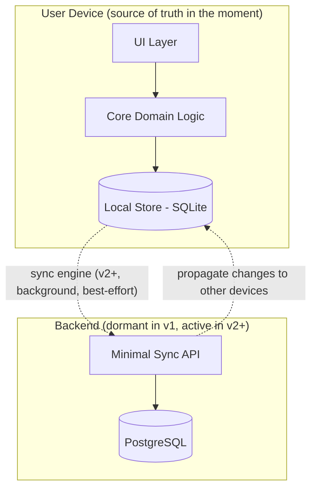
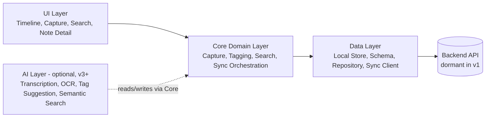
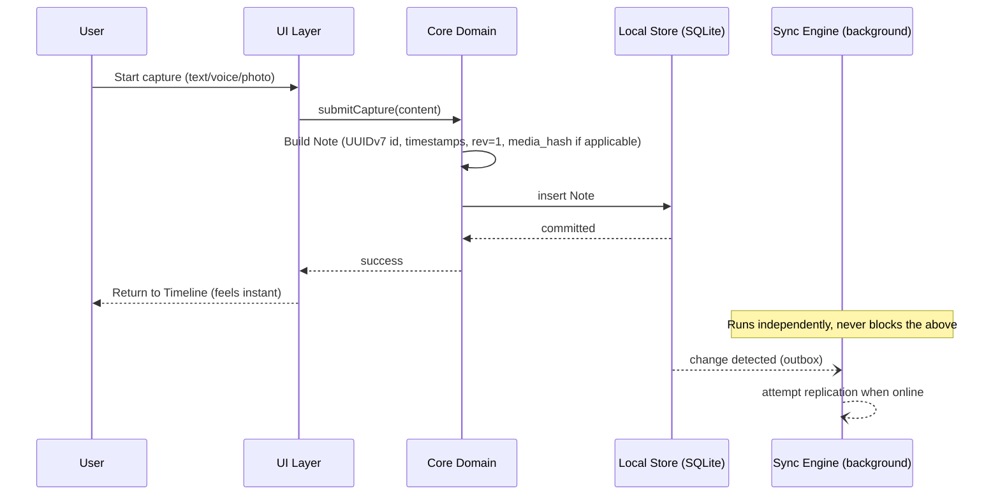
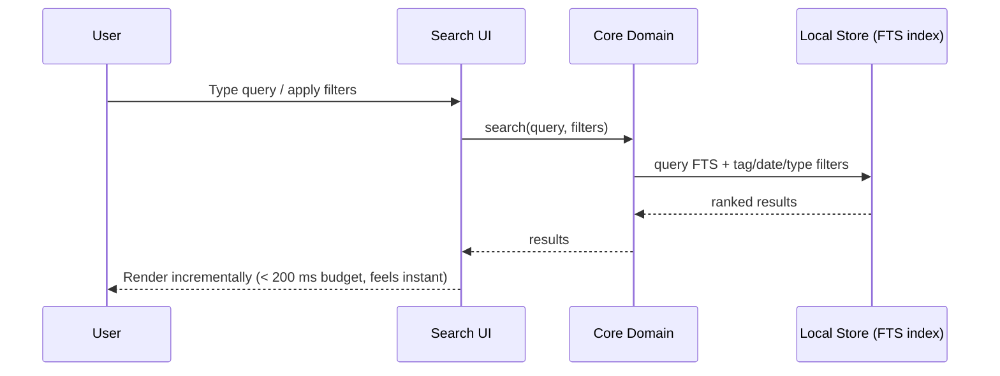
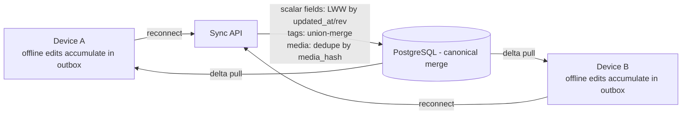

# Nex — Architecture

> Technical companion to [`02-product-specification.md`](./02-product-specification.md). Local-first. Offline-first. Modular. Built so sync can arrive in v2 with **no rewrite**.

**Status:** Authoritative · **Owner:** Engineering · **Last updated:** 2026

---

## Guiding Constraints

The architecture exists to serve four constraints, in priority order:

1. **Capture must never wait on the network.**
2. **Capture must never wait on AI.**
3. **Data must be structured for future sync from day one**, without a v2 rewrite.
4. **The system must remain small and legible** — no infrastructure beyond what the product currently needs.

---

## Local-First Architecture

Nex treats the **device's local store as the single source of truth**. Every read and write goes to the local database first. The app is fully functional offline. Any cloud backend is a **sync layer**, never a dependency — if the backend disappears, Nex still works.

This choice is deliberate: the core problem is **lost and scattered ideas**. A purely cloud-dependent app fails the moment connectivity drops; a local-first app never fails to capture.

---

## Modular Architecture

The system is organized into independently testable modules with a strict dependency direction: UI depends on Core, Core depends on Data — never the reverse.

| Layer | Responsibility | Notes |
|---|---|---|
| **UI Layer** | Renders Timeline, Capture flow, Search, Note Detail. No persistence or business logic. | Shared across platforms via `packages/ui`. |
| **Core Domain Layer** | Capture orchestration, tag management, search query composition, sync orchestration (what to sync, when, conflict policy). | Platform-agnostic; pure business logic, fully unit-testable without a UI or database. |
| **Data Layer** | Local persistent storage (SQLite), repository interfaces, the sync client. | Owns the schema described in [`02-product-specification.md`](./02-product-specification.md#data-model). |
| **Backend (minimal)** | Small REST/JSON API plus PostgreSQL, providing durable multi-device storage and conflict-aware replication. | Present from v1 as infrastructure, not exercised until v2 sync ships. |
| **AI Layer (optional)** | Transcription, OCR, tag suggestion, semantic search, summarization. | Strictly additive; communicates with Core through well-defined, asynchronous, non-blocking interfaces. Fully removable without breaking any other layer. |

This separation guarantees that **AI can be deleted from the build entirely and the product still fully satisfies its MVP promise** — the architectural expression of "AI-optional."

---

## Data Flow

### Capture (the critical path)

The capture path never touches the network. The sync engine observes local changes via an outbox/changefeed pattern and replicates opportunistically in the background.

### Search

Search executes entirely against the local store. Text notes are indexed at write time (SQLite FTS5) so query latency stays flat regardless of corpus size at personal-use volumes — this is the CI-enforced engineering budget behind the user-facing "find instantly" promise (see [`02-product-specification.md`](./02-product-specification.md#non-functional-requirements)).

---

## Storage

- **On-device:** SQLite is the canonical local store — transactional, requires no separate server process, supports full-text search natively (FTS5), and is available across Android, Windows, and iOS runtimes.
- **Media (voice, photo):** Binary content is stored on the device filesystem; the database stores only a reference URI plus metadata (duration, mime type, size) and a **content hash** (`media_hash`). This keeps the SQLite database small and fast regardless of media volume, and is the same hash used for sync-time deduplication (see [Sync](#sync) below).
- **Backend:** PostgreSQL, matching the local schema closely so replication logic maps one-to-one between local and remote representations. Media in the cloud (v2+) is stored in object storage, referenced by URL and keyed by `media_hash` — never inlined in the database.

---

## Sync

Sync is designed in v1 but not switched on for end users until v2.

### Why UUIDv7

Every note's primary key is a **UUIDv7**, generated client-side at capture time, rather than a random UUIDv4 or a server-assigned auto-increment integer:

- It is **globally unique across offline devices** without coordination — a hard requirement for multi-device sync.
- It **embeds a millisecond-precision timestamp** in its high bits, so IDs sort chronologically by creation time. Since the Timeline's core query is "newest first," this gives natural index locality for the single most common query in the product, without relying solely on a secondary `created_at` index.
- It avoids the write-amplification and index fragmentation that random UUIDv4 keys cause in B-tree indexes at scale.

### Conflict resolution

Sync is designed to be **additive, not corrective** — it should never need to "fix" a v1 schema, because the schema is already sync-shaped (UUIDv7, `device_id`, `updated_at`, `rev`, soft deletes, `media_hash`).

Conflict resolution is **not uniformly last-writer-wins at the record level** — it is field-aware:

| Conflict | Rule | Why |
|---|---|---|
| Scalar fields (`content`, `media_uri`) edited on two devices | Last-writer-wins by `updated_at` / `rev` | These fields are rarely collaboratively edited; simple LWW is sufficient and keeps v1 sync logic small. |
| Tags added/removed concurrently on two devices | **Union-merge** — the resulting tag set is the union of both devices' tag sets; a tag is never silently dropped because it lost a whole-record LWW race | A note's body and its tags are edited independently and asynchronously in normal use (e.g., tag it on the phone while editing text on desktop); collapsing both into one LWW decision would silently lose a tag half the time. See [ADR-020](./10-decisions.md#adr-020--union-merge-for-concurrent-tag-edits). |
| Deleted on one device, edited on another | Deletion wins (tombstone), edit recoverable from history | Consistent, predictable, and sync-safe. |
| Media differences | Reconciled by `media_hash`; identical content is deduplicated, never re-uploaded | Saves bandwidth and storage; avoids duplicate captures across devices that happen to hold the same file. |

### Sequencing

- **v1:** Local-first storage only. Every record already has a UUIDv7, timestamps, `device_id`, `rev`, and `media_hash`. A minimal backend API surface exists (unused by the client) so the contract is proven early.
- **v2:** Real sync between Android and Windows — the first item of v2, not the last (see [ADR-007](./10-decisions.md#adr-007--sync-ships-as-the-first-item-of-v2-not-the-last)). Offline-tolerant: devices accumulate an outbox of unsynced changes and flush opportunistically; a device offline for weeks reconciles cleanly on reconnect. Deletions propagate as tombstones, garbage-collected after a retention window once all known devices acknowledge them.
- **v2.x:** iOS client joins the same sync backend.

Sequencing detail lives in [`08-roadmap.md`](./08-roadmap.md); this document only fixes the shape, not the ship date.

---

## Scalability

Nex's scalability profile is intentionally personal-scale, not enterprise-scale.

- **Per-user data volume:** designed comfortably for tens of thousands of notes per user; SQLite FTS and indexed queries (aided by UUIDv7's natural time-ordering) keep both timeline scroll and search flat in perceived latency at this scale.
- **Backend scaling (v2+):** the API is stateless and horizontally scalable behind a load balancer; PostgreSQL is the only stateful component and can be scaled vertically well beyond any realistic single-user or household-scale usage before sharding is needed.
- **No premature multi-tenancy complexity:** the backend is a straightforward per-user data store; there is no team/workspace concept to scale for, by design.

---

## Performance Principles

1. **The capture path touches only local storage.** No network call, no AI call, no synchronous validation beyond what's needed to write a row.
2. **Writes are optimistic and immediate.** The UI reflects a successful capture before any background process (sync, AI) has even started.
3. **Search is index-backed, not scan-backed.** Full-text and filter queries use database indexes; there is no "search everything, filter in memory" fallback in the main path.
4. **Media stays off the hot path.** Large binary content never blocks the database transaction that records the note's existence.
5. **AI is asynchronous and cancellable.** Any AI-layer operation (v3+) runs after capture completes and can fail or be disabled without affecting the note that already exists.
6. **Cold start is a first-class metric.** The Timeline renders from local data alone, before any network or AI initialization occurs.
7. **Engineering budgets are stricter than the user-facing promise, by design** (see [`02-product-specification.md`](./02-product-specification.md#non-functional-requirements)) — this margin is what keeps the 3-second promise true under real-world device and data variance.

These principles are the technical embodiment of the product's non-negotiable principle: *"If a feature slows down capture, it does not belong in Nex."*
