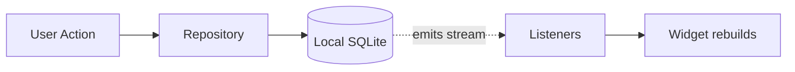

# Nex — Development Guide

> Write code like the product feels: simple, fast, reliable, and free of unnecessary ceremony. Pairs with [`04-architecture.md`](./04-architecture.md) (the *what/why*) and [`07-contributing.md`](./07-contributing.md) (the *process*).

**Status:** Authoritative · **Owner:** Engineering · **Last updated:** 2026

---

## Coding Principles

1. **Optimize for capture-path latency above all else.** Any change touching the capture flow must be measured against the engineering performance budget (see [`02-product-specification.md`](./02-product-specification.md#non-functional-requirements)) before merge.
2. **Prefer boring, proven technology.** Nex's value is in restraint, not novelty — this applies to code as much as to product surface.
3. **No speculative abstraction.** Don't build configurability, plugin systems, or generic frameworks for requirements that don't exist yet (e.g., don't pre-build a "file attachment" abstraction ahead of its v2 scope).
4. **Local-first is a hard constraint, not an implementation detail.** Every feature must work fully offline unless it is explicitly, unavoidably a network feature (sync itself, AI transcription).
5. **AI code paths must be structurally optional.** Any AI-layer integration must be behind an interface that can be no-op'd or removed without touching Core or UI layers.
6. **Small, composable modules over large, stateful ones.** Favor pure functions in Core; keep side effects (storage, network, media I/O) isolated at the edges (Data layer).
7. **Every non-negotiable principle in the [Vision doc](./01-product-vision.md#non-negotiable-principles) is a code review gate**, not just a design guideline.

---

## Folder Structure

The structure mirrors the architecture layers, and is organized as a monorepo so that the client and backend share one Core and Data layer — required for a genuinely cross-platform, sync-ready product from day one. See [ADR-024](./10-decisions.md#adr-024--flutter-as-the-single-cross-platform-client-framework) for why this is a single Flutter client target rather than a separate mobile shell and desktop shell.

```
nex/
├── apps/
│   ├── client/                    # Single Flutter app — builds to Android, Windows, future iOS
│   │   ├── lib/
│   │   │   ├── screens/           # Timeline, Capture, Search, NoteDetail, Settings
│   │   │   ├── navigation/
│   │   │   └── platform/          # platform channels (camera, mic, filesystem) where a plugin doesn't already cover it
│   │   └── ...
│   └── backend/                   # Minimal Node.js + PostgreSQL sync API
│       ├── src/
│       │   ├── routes/            # notes, tags, sync
│       │   ├── db/                 # schema + migrations
│       │   └── services/
│       └── ...
├── packages/
│   ├── core/                      # Platform-agnostic domain logic (pure Dart, no Flutter dependency)
│   │   ├── capture/
│   │   ├── search/
│   │   ├── tags/
│   │   └── sync/                  # conflict resolution: LWW for scalars, union-merge for tags
│   ├── data/                      # Local-first storage layer (pure Dart)
│   │   ├── schema/                 # note.id: UUIDv7, rev, media_hash, deleted_at
│   │   ├── repositories/
│   │   └── sync_client/
│   ├── ui/                        # Shared Flutter widget/design-system package
│   │   ├── widgets/
│   │   └── tokens/                  # colors, typography, spacing — see 05-design.md
│   └── ai/                        # Optional AI adapters (v3+) — never imported by capture
│       ├── transcription/
│       ├── ocr/
│       └── tagging/
├── docs/                           # This documentation set
└── README.md
```

Each `packages/*` module is independently unit-testable and has no dependency on `apps/client` or `apps/backend`. `packages/core` and `packages/data` are plain Dart with zero Flutter/widget dependency, so Core domain logic can be tested with `dart test` alone, with no simulator, emulator, or widget test harness required. **Dependency rule:** `apps/* → packages/core → packages/data`. `packages/ui` depends on Flutter; `packages/ai` and the sync client are optional leaves — nothing in the capture path may import them.

---

## Naming Conventions

| Element | Convention | Example | Applies to |
|---|---|---|---|
| Files | `snake_case.dart` | `note_card.dart`, `capture_sheet.dart` | Client (Dart) |
| Classes / Widgets | `PascalCase` | `NoteCard`, `CaptureSheet` | Client (Dart) |
| Functions/variables | `camelCase` | `submitCapture`, `createdAt` | Client (Dart) + backend (TS) |
| Types/classes (domain) | `PascalCase`, no `I` prefix | `Note`, `SearchFilters` | Client (Dart) |
| Constants | `lowerCamelCase` per Dart convention (`k`-prefix only if truly global) | `maxTagLength` | Client (Dart) |
| Backend files | `kebab-case.ts` | `note-repository.ts` | Backend (Node/TS) |
| Database columns | `snake_case` | `created_at`, `media_hash` | Backend / schema |
| Branches | `type/short-description` | `feat/voice-capture-waveform`, `fix/search-date-filter-timezone` | All |
| Commits | [Conventional Commits](https://www.conventionalcommits.org/) | `feat:`, `fix:`, `perf:`, `refactor:`, `test:`, `docs:`, `chore:` | All |

Be consistent within a file and descriptive over abbreviated: `createdAt` beats `ca`. The client (`apps/client`, `packages/core`, `packages/data`, `packages/ui`) is Dart and follows standard [Effective Dart](https://dart.dev/effective-dart) style; only the backend (`apps/backend`) is Node.js/TypeScript, since the client's move to Flutter (see [ADR-024](./10-decisions.md#adr-024--flutter-as-the-single-cross-platform-client-framework)) doesn't change the backend's language.

---

## State Management Recommendation

Nex's state needs are intentionally modest.

- **Persisted domain state** (notes, tags): owned by the **Data layer** (SQLite-backed repositories, via `drift`/`sqflite`), exposed to the UI via reactive streams — the Timeline updates automatically as the local store changes, including from background sync writes.
- **Local, ephemeral UI state** (capture sheet open/closed, in-progress text before persistence, active search filters, swipe-reveal position): local widget state (`StatefulWidget` / `ValueNotifier`). A minimal reactive layer (`Provider` or `Riverpod`) is enough for cross-cutting app state (active filters, current Settings values) — a large, generalized framework (e.g., BLoC's full ceremony) would be over-engineering relative to the product's scope.
- **Explicit rule:** state management choices must never introduce a delay between "user provided content" and "content is durably saved." Any layer between UI and Data must be write-through, not write-behind, for capture actions.



---

## AI Adapter Interface

AI integrations live entirely in `packages/ai` and are consumed by Core through a single provider-agnostic interface. This is the concrete, code-level expression of "AI is optional and swappable" — Core calls the interface, never a specific vendor SDK, and every method is nullable/optional so an adapter may implement any subset of capabilities:

```dart
abstract class AIAdapter {
  Future<Transcript>? transcribe(AudioRef audio);
  Future<Vector>? embed(String text);
  Future<List<Tag>>? suggestTags(Note note);
  Future<Summary>? summarize(Note note);
  Future<OCRText>? ocr(ImageRef image);
}
```

- Missing capabilities are simply unavailable, not errors — Core degrades gracefully.
- Swapping a model or provider must not touch domain, storage, or UI code.
- Default to on-device implementations where feasible; any cloud-backed implementation is opt-in per the [AI Strategy](./09-ai.md).

---

## Error Handling

- **Capture must never surface a blocking error to the user.** If local persistence fails, the UI retries transparently and only surfaces a non-blocking, dismissible notice if content genuinely could not be saved — never a modal that halts the flow.
- **Fail closed on ambiguity for writes; fail open for reads.** A failed search returns an empty result with a message, not a crash.
- **Typed domain errors** (`CaptureFailed`, `SearchUnavailable`, `SyncConflict`) instead of raw strings or leaked DB/network exceptions — the UI never sees implementation-level errors.
- **Network and sync errors are silent by default,** logged and retried with backoff; they never interrupt the user's current screen or task.
- **AI errors are always non-blocking and reversible.** A failed transcription, OCR pass, or tag suggestion simply leaves the note in its prior state.
- **Fail loudly in development, fail quietly in production.**

---

## Logging

- **Structured logging only** — every entry is a structured object (level, module, message, context), never a free-form string.
- **Levels:** `debug` (dev only), `info` (lifecycle events), `warn` (recoverable issues), `error` (unexpected failures).
- **No content logging, ever.** Note content, tags, and media are never written to logs, locally or remotely — a privacy requirement, not a style preference (see [`09-ai.md`](./09-ai.md)).
- **Client-side logs stay local** by default; opt-in diagnostic sharing, if ever introduced, must be explicit, scoped, and time-limited.
- **Backend logs** (v2+) are centralized for operational monitoring (error rates, sync latency, API availability) but exclude request bodies containing user content.

---

## Testing Strategy

Testing effort is weighted toward the parts of the system where a regression most directly breaks the product's core promise.

| Layer | Test Type | Priority |
|---|---|---|
| Core domain (capture, search, tags, sync orchestration incl. tag union-merge) | Unit tests, high coverage | Highest |
| Data layer (repositories, schema, sync client) | Integration tests against a real local SQLite instance | Critical — persistence correctness is non-negotiable |
| Capture flow | E2E: open → capture → persisted → on Timeline, under budget | Critical — this is literally the product's promise |
| Search | Tests for text, tag, date, and type filters + ranking | High |
| Sync (v2) | Conflict-resolution tests: scalar LWW, tag union-merge, tombstones, media dedupe by `media_hash` | High once sync ships |
| UI components | Render, tap, assert state; accessibility, keyboard, reduced-motion | Medium |
| Performance | Automated timing assertions on capture-to-save and query-to-result | High — regressions here are regressions of the core value proposition, gated in CI |

CI gates on: unit + integration test suites, capture/search performance budgets, and lint/type-check passing. No feature merges if it regresses the capture or find performance budget.

---

## Git Workflow

- **Trunk-based development** on `main`, with short-lived feature branches (`type/short-description`).
- **Pull requests required** for all changes; at least one review approval before merge.
- **CI must pass** (typecheck, lint, unit/integration tests, performance budget checks) before merge. Branch protection requires exactly one check, `CI green`, which aggregates every job.
- **CI runs only what a change can break.** A `changes` job diffs the pull request against its base and gates the rest: a Flutter-only change skips the backend suite, the PostgreSQL sync matrix and the Windows runner; a documentation-only change skips essentially everything. A push to `main`, and the release workflow, always run the full matrix — there is no base to compare against, and a release must verify everything. Touching `.github/` also runs everything, since the pipeline is what would otherwise ship untested.
- **Skipped is not failed.** `CI green` treats a skipped job as success, which is what makes the gating safe; it treats an absent or errored job as failure, which is what makes it a real gate.
- **Squash-merge** to keep `main` history linear, with a Conventional Commits-formatted message.
- **Releases are tagged** (`vMAJOR.MINOR.PATCH`); sync-contract changes are `MAJOR`.
- **No direct commits to `main`**, including for documentation.

### Cutting a Release

**The tag is the version.** There is exactly one number to decide and one place to type it — nothing has to be edited first. The Release workflow parses the tag, stamps `pubspec.yaml` and `lib/app_version.dart` in its own checkout, derives the Android `versionCode` from it, and passes it to every build.

Either way works:

- **From a terminal**, once the work is merged to `main`:
  ```
  git fetch origin main
  git tag v0.2.1 origin/main
  git push origin v0.2.1
  ```
- **From GitHub**, with no git at all: Actions → Release → Run workflow → type `0.2.1`. A manual run publishes a **draft** release, so it is also how you rehearse one.

The tag must be `vMAJOR.MINOR.PATCH`, optionally with a pre-release suffix (`v0.2.1-beta`). A leading `v` is added if you leave it off, but anything else — `v.0.2.1`, `v0.2.`, a stray space — is rejected in the first job with an explicit message, rather than surfacing later as a confusing mismatch.

Two rules the numbers have to obey:

- **Tag `main` after the work is merged, not before.** A tag names a commit; tagging the branch or an older `main` releases whatever was on that commit.
- **Never reuse or go backwards.** `versionCode` is `major×1000000 + minor×1000 + patch`, so `0.2.1` is `2001`. Google Play requires it to increase strictly and forever, and Android refuses to install an APK whose `versionCode` is lower than the installed one.

**Rename the changelog heading before you tag.** [`CHANGELOG.md`](../CHANGELOG.md)'s top section — whatever it is titled — is published as-is as both the GitHub Release body and the in-app update sheet's content. As part of the same merge to `main` that you are about to tag, rename its `## Unreleased` heading to `## vX.Y.Z` matching the tag, and start a fresh `## Unreleased` above it. The release workflow refuses to publish if the top heading is still literally `Unreleased`.

`version:` in `apps/client/pubspec.yaml` stays as the local development default, kept in step with `lib/app_version.dart` by `version_test.dart`. Releases overwrite both from the tag, so a stale value there can no longer block or mislabel a release.
The workflow builds a signed Android App Bundle plus split APKs and attaches them to the GitHub Release. Every build waits on the full CI suite first — tags do not match branches, so without that gate a tag would ship straight to a public release without ever running analyze or the tests.

**Android only, for now.** The Windows installer and the iOS compile check are paused — Windows runners bill at 2x and macOS at 10x, and between them they were most of a monthly Actions allowance that ran out twice. Each paused job carries an `if: false` and a comment saying what its absence costs and exactly how to bring it back; the Windows one also lists the three edits `publish-release` needs, because none of them fail loudly on their own. While this holds, existing Windows users are not offered updates: the updater finds no `.exe` asset and reports no update available, so they stay on the version they have.

**One-time signing setup** (never commit the keystore):

- Generate: `keytool -genkey -v -keystore nex-release.keystore -alias nex -keyalg RSA -keysize 2048 -validity 10000`
- Base64-encode it and store the file somewhere safe — it is not recoverable if lost, and losing it means the app can never be updated under the same identity again.
- Add the GitHub Actions secrets: `ANDROID_KEYSTORE_BASE64`, `ANDROID_KEYSTORE_PASSWORD`, `ANDROID_KEY_ALIAS`, `ANDROID_KEY_PASSWORD`.

See [`07-contributing.md`](./07-contributing.md) for the contributor workflow.
