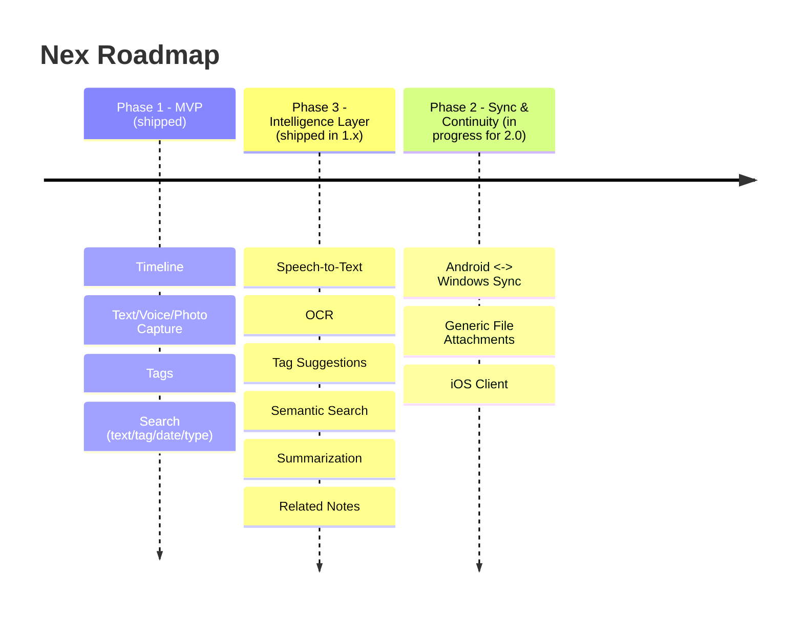

# Nex — Roadmap

> Sequencing detail for [`02-product-specification.md`](./02-product-specification.md#roadmap-summary). Every item below is checked against the [Non-Negotiable Principles](./01-product-vision.md#non-negotiable-principles) before it ships.

**Status:** Living document · **Owner:** Product & Engineering · **Last updated:** 2026

> **Phases, not versions.** Until 1.85 the phases below were called *v1, v2, v3*, which collided with the release numbers: the app is at release 1.8x, has shipped all of Phase 3, and has not yet finished Phase 2. They are **Phase 1, 2 and 3** now. Documents written earlier (the product vision and specification, and some ADR titles) still say *v1/v2/v3* — read those as Phase 1/2/3, never as release numbers. What release 2.0 contains is planned in [`NEX_V2_ROADMAP.md`](./NEX_V2_ROADMAP.md).

---

## Guiding Rules

1. **The capture budget is fixed.** Every version must keep capture feeling instant and offline-capable.
2. **Organize later, always.** New organization never moves into the capture flow.
3. **AI is additive.** Intelligence assists after capture; it never gates or interrupts it.
4. **Sync is the Phase 2 headline.** Cross-device sync is the first item of Phase 2, not the last — scattered ideas are the core problem.
5. **Scope is defended.** Features are phase-gated to keep Phase 1 light.

---

## Phase 1 — Fastest Capture Experience (MVP)

**Status:** Shipped (release 1.0 and the 1.x polish below).

**Theme:** Prove the two core promises — capture and find both feel instant — with the smallest possible feature set.

| Feature | Notes |
|---|---|
| Timeline (reverse-chronological, no folders) | See [Spec §Timeline](./02-product-specification.md) |
| Text capture | Zero-field entry, auto-save |
| Voice capture | Instant-start recording |
| Photo capture | Camera + gallery, two taps |
| Auto-save (no Save button) | Core non-negotiable principle |
| Tags (optional, freeform) | Only organizational primitive |
| Search — keyword, tag, date, content-type filter | Content-type layered onto the same search surface, not a separate mode |
| Local-first storage, sync-ready schema | UUIDv7 ids, `rev`, `device_id`, `media_hash`, soft delete — see [`04-architecture.md`](./04-architecture.md) |
| Minimal dormant backend | Proves the sync contract early without being load-bearing |
| **Data export** (JSON + Markdown + media) | Manual, one-tap, offline — see [ADR-025](./10-decisions.md#adr-025--data-export-ships-in-v1-not-after-v3) |
| **Automatic backup + one-tap restore** | Rotating local SQLite snapshots — see [ADR-026](./10-decisions.md#adr-026--automatic-local-backup--restore-ships-in-v1) |

**Exit criteria:** Usability testing shows capture and find both feel instant (< 3 s) across all three content types; engineering performance budgets met in CI; crash-free session rate > 99.9%; export round-trip and backup-restore-after-corruption both verified.

### Phase 1 follow-up — Stability & Polish

Ranked by leverage against the core "capture in under 3 seconds" promise — OS-level capture surfaces ship first, ahead of in-app polish that touches fewer moments of actual friction:

- **Home-screen widget + Android share-intent capture** — opens directly into text capture, or accepts shared text/links/photos from other apps, without requiring the user to open Nex first. Higher-leverage against the core promise than the in-app items below — see [ADR-027](./10-decisions.md#adr-027--os-level-capture-surfaces-home-screen-widget-share-intent-added-to-v1x-scope).
- Performance tuning for large timelines (thousands of notes).
- WCAG 2.1 AA accessibility audit and fixes.
- Expanded automated performance budget tests in CI.
- Localization groundwork (externalized strings; Persian as the first additional language); Persian FTS5 tokenization verified per [ADR-028](./10-decisions.md#adr-028--explicit-fts5-tokenization-strategy-for-multilingual-persian-first-search).
- Swipe actions on Timeline cards (Delete, Add Tag), with a user-configurable direction mapping and a new lightweight Settings sheet — see [ADR-022](./10-decisions.md#adr-022--swipe-actions-are-configurable-per-edge-from-an-open-set).
- Comfort Mode — a lower-contrast, warmer-color-temperature toggle independent of Light/Dark theme, for late-night and light-sensitive use — see [ADR-023](./10-decisions.md#adr-023--comfort-mode-as-an-independent-axis-from-lightdark-theme).

---

## Phase 2 — Sync & Continuity

**Status:** In progress. The sync engine and backend exist; pairing, automatic sync, media sync and a second device are what release 2.0 is for — see W1 in [`NEX_V2_ROADMAP.md`](./NEX_V2_ROADMAP.md#w1--continuity). File attachments shipped early.

**Theme:** Solve the original motivating problem in full — a user's captures should never be stranded on a single device. Sync ships as the **first** item of Phase 2, not the last.

| Feature | Notes |
|---|---|
| **Real Android ⇄ Windows sync** | First item of Phase 2. Field-aware conflict resolution: LWW by `updated_at`/`rev` for scalar fields, **union-merge for tags** — see [`04-architecture.md`](./04-architecture.md#sync) |
| Media sync | Content-addressed uploads keyed by `media_hash`, deduplicated across devices |
| Generic file attachments (4th capture type) | *Shipped in 1.x.* Deferred from Phase 1 specifically because of the UX decisions it requires (preview, size limits, file types) |
| iOS client | Joins the same sync backend and shared Core/Data packages |
| Backend hardening | Multi-device conflict test suite, delta-sync efficiency, deletion propagation and tombstone garbage collection |

**Exit criteria:** A user can capture offline on Android and see the same note — including tag and content edits made concurrently on both devices — converge correctly on Windows once both are online; deletion, conflict, and dedupe test suites pass.

---

## Phase 3 — The Intelligence Layer

**Status:** Shipped during 1.x, ahead of Phase 2, with an assistant, a daily summary and an on-device model beyond what is listed here.

**Theme:** Make everything captured — regardless of original format — as findable as typed text, using AI that never interrupts capture. Full detail in [`09-ai.md`](./09-ai.md).

| Feature | Notes |
|---|---|
| **Speech-to-text transcription** | Resolves the voice-search limitation noted since Phase 1; voice notes join full-text search |
| **OCR** | Photo notes become text-searchable |
| **Tag suggestions** | AI proposes tags post-capture; always optional, always dismissible, never auto-applied silently |
| **Semantic search** | Search by meaning, not just keyword match |
| **Summarization** | On-demand summaries for long text notes or clusters of related notes |
| **Related notes** | Surfaces connections between notes without requiring manual organization |

**Exit criteria:** Voice and photo notes are fully part of unified search without any regression to capture speed; every AI feature is independently toggleable off with zero loss of core (Phase 1) functionality.

---

## Explicitly Deferred / Not Currently Planned

- **Team/multi-user collaboration** — out of scope indefinitely; contradicts the single-player, personal-inbox identity.
- **Complex organizational features** (nested tags, folders, databases) — would contradict "Organize Later" as a philosophy, not just a feature gap.

---

## Versioning Policy

- **Release numbers are ordinary semantic versions** and do not name phases. A major release (2.0) marks a change people will notice across the whole app — for 2.0, continuity across devices — not the start of a phase.
- **Minor versions** ship features, from any phase that is active.
- **Patch versions** are reserved for fixes and do not introduce new user-facing behavior.

Any roadmap change (addition, removal, re-sequencing) must be recorded in [`10-decisions.md`](./10-decisions.md) with rationale.
