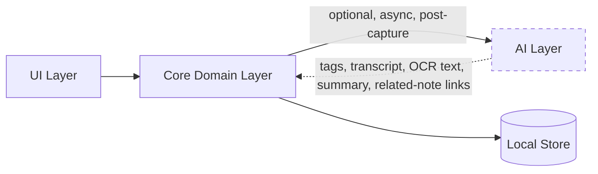

# Nex — AI Strategy

> Companion to [`01-product-vision.md`](./01-product-vision.md#ai-philosophy) and [`04-architecture.md`](./04-architecture.md#modular-architecture). This document defines exactly where AI is allowed to participate in Nex, and where it is explicitly forbidden.

**Status:** Authoritative · **Owner:** Product & Engineering · **Last updated:** 2026

---

## Guiding Rule

> **AI is optional. AI never slows down capture.**

Every AI feature in Nex must satisfy both halves of this rule simultaneously. A feature that is optional but still delays capture (e.g., waiting for an AI tag suggestion before saving) is a violation. A feature that is fast but not optional (e.g., forced transcription with no way to disable it) is equally a violation.

> Rule of thumb: **if removing all AI changes the capture experience by zero milliseconds, the design is correct.**

---

## What AI Is Allowed to Do

AI exists to reduce friction **after** capture — helping the user find, understand, or connect what they've already saved. It is never a precondition for saving.

| Capability | Description | Target Version |
|---|---|---|
| **Transcription (Speech-to-Text)** | Converts voice notes into searchable text, resolving the [v1 voice-search limitation](./02-product-specification.md#search) | v3 |
| **OCR** | Extracts text from photos so they become keyword-searchable | v3 |
| **Tagging** | Suggests optional tags for a note after it's saved | v3 |
| **Semantic search** | Finds notes by meaning/intent, complementing keyword search | v3 |
| **Summarization** | On-demand summaries of long notes or clusters of related notes | v3+ |
| **Related notes** | Surfaces connections between notes without manual organization | v3+ |

All capabilities are:
- **Post-capture only** — they run after a note already exists and is safely persisted.
- **Asynchronous** — never block the UI thread or the capture flow.
- **Dismissible** — any suggestion can be ignored with no consequence.
- **Non-destructive** — AI never overwrites or deletes original user content; it only adds metadata (tags, transcript text, OCR text) alongside it.
- **Independently toggleable** — each capability can be turned off individually, and the app remains fully functional (per the v1 MVP feature set) with all of them off.

---

## What AI Must Never Do

- ❌ Block, delay, or gate capture.
- ❌ Require a decision (title, folder, format, confirmation) at capture time.
- ❌ Send user content off-device by default.
- ❌ Become a dependency — the app must work fully with AI disabled or unavailable.
- ❌ Silently rewrite or delete user content.
- ❌ Make retrieval worse via false confidence — semantic search results must be clearly distinguishable from exact keyword matches so users can calibrate trust appropriately.
- ❌ Introduce UI complexity that slows finding.

---

## Architectural Boundary

AI lives in its own package (`packages/ai`, see [`06-development.md`](./06-development.md#folder-structure)) that the Core domain layer calls into through a well-defined, optional interface — never the reverse, and never from the UI directly.



The dashed boundary is intentional: **the AI layer can be deleted from a build entirely**, and Core, Data, and UI continue to compile and function, fully satisfying the v1 MVP. This is the architectural proof of "AI-optional," not just a policy statement.

### Provider-Agnostic Adapter Interface

A single, common interface hides the underlying model or vendor behind it. Every method is optional (`?`), so an adapter may implement any subset of capabilities — missing capabilities are simply unavailable, not errors:

```dart
abstract class AIAdapter {
  Future<Transcript>? transcribe(AudioRef audio);
  Future<Vector>? embed(String text);
  Future<List<Tag>>? suggestTags(Note note);
  Future<Summary>? summarize(Note note);
  Future<OCRText>? ocr(ImageRef image);
}
```

- **Pluggable backends:** on-device models, a self-hosted service, or a cloud provider — chosen by the user, all behind the same interface.
- **No vendor lock-in.** Swapping a model must not touch domain, storage, or UI code.
- **Default to local.** The out-of-the-box experience prefers on-device intelligence; cloud is an explicit opt-in.
- **Three wire formats, one contract.** OpenAI chat-completions, Anthropic Messages and Gemini `generateContent` share nothing but the shape of this interface — not the path, not the auth header, not the request body. Gemini in particular authenticates with `x-goog-api-key` rather than a bearer token, so it is its own provider and cannot be reached through the OpenAI-compatible "custom" option.

---

## When AI Runs, and When It Shows

These are two separate questions and the answers are deliberately different.

- **Runs: on its own, in the background.** A recording is transcribed and a long note summarised right after capture, off the capture path, and failures leave the note untouched. The user should never have to ask for the work.
- **Shows: only when asked.** A note is the user's own writing; a machine's reading of it does not get to open on top of that. The detail sheet holds everything derived — transcript, OCR text, summary, suggested tags, related notes — behind one row that names what is there. That row is also where the on-demand calls happen, so opening a note fires no request at all.
- **Backfill, because "automatic" is a promise about the library, not about a moment.** Enrichment runs at capture, and the layer is off by default, so at the instant a user turns it on every note they own was captured while nothing could read it. Without a backfill pass "automatic transcription" would quietly mean "automatic for notes captured from now on" — see FR-8b.8. The pass is bounded, sequential, and stops at the first note that yields nothing, because that is what an exhausted free-tier quota looks like from inside the app.

---

## Data & Privacy Principles for AI

- **No note content is sent anywhere by default.** Any AI processing that requires leaving the device is explicitly opt-in per feature, not a blanket toggle.
- **On-device processing is preferred** for transcription and OCR where platform capability allows it.
- **AI-derived data is clearly labeled** in the data model (e.g., a transcript is stored as `transcript_text`, distinct from the original `content`/`media_uri`), so the provenance of any searchable text is always inspectable and reversible.
- **No content is used to train models** without separate, explicit, revocable consent.
- Logging rules from [`06-development.md`](./06-development.md#logging) apply equally to AI subsystems: no note content in logs, structured metadata only.

---

## Rollout Plan

1. **v1–v2:** No AI in the product. The Timeline, capture, tags, search, and sync all prove their value on their own merits first.
2. **v3.0:** Transcription and OCR ship first, because they directly resolve a documented product gap (voice/photo notes not being keyword-searchable).
3. **v3.x:** Tag suggestions, semantic search, summarization, and related notes follow, each shipped independently and each independently toggleable.

See [`08-roadmap.md`](./08-roadmap.md#v3--the-intelligence-layer) for full sequencing.

---

## Failure Modes

| Scenario | Behavior |
|---|---|
| AI disabled by user | Everything works exactly like AI-free Nex |
| AI provider unavailable/errored | Capture/search unaffected; enrichment silently skipped/retried |
| Transcription fails for an audio note | Note remains tag/date-searchable; UI keeps the honest label |
| Cloud opt-in revoked | On-device features continue; cloud features stop; no data loss |

---

## Offline Local-Model Track

A separate, later track from the rollout above: a fully local, no-API,
no-internet chat/assistant layer, running a downloadable on-device model
instead of the heuristic stub `OnDeviceAIAdapter` uses today. This section
phases that full scope — chat, tool-calling into Nex's own capabilities, a
local memory/profile store, context import from other AIs, a free/paid
capability split — so the plan isn't lost between sessions. Phase 0 is
built and done; Phase 1 is next; Phase 2's technical foundation (contract,
schema, gating hook) is designed and scaffolded now, ahead of the chat
loop that will drive it, because none of it depends on the still-pending
on-device benchmark (see Phase 0 below).

**Scope for now: Android only.** No Windows work for this track until
feasibility is proven — see [ADR-024](./10-decisions.md#adr-024--flutter-as-the-single-cross-platform-client-framework)
for why the rest of the app stays cross-platform regardless. Distribution
target is Cafe Bazaar / Myket, not Google Play, for now — Play is a later,
explicit decision, not a blocker for this track.

### Free vs. Paid Boundary

The whole track sits behind one product rule: **general-purpose chat is
free forever; the "personal assistant" layer built on top of it is the
paid tier.** Concretely:

| Free (everyone, forever) | Paid ("personal assistant" tier) |
|---|---|
| General chat — Q&A, math, writing help, translation, summarization, idea generation | Long-term/personal memory, gradual profile learning |
| The existing online capabilities (transcription, OCR, tag suggestion, summarization) once they gain a local-model backend | Behavioral-pattern learning |
| — | Task/reminder execution |
| — | Deep tool-calling into Nex's own capabilities (create/edit notes, tagging, search) |
| — | Cross-AI context import |

A request that exceeds chat's scope ceiling (e.g., "build me a full
app") must be told explicitly that it's out of scope for Nex — never
answered partially or at excessive length. See
[ADR-030](./10-decisions.md#adr-030--freepaid-boundary-for-the-personal-assistant-tier-gated-by-a-structural-entitlement-hook)
for why the boundary sits exactly here and how it's gated in code.

### Phase 0 — Feasibility (done)

- Runtime: [`llama_cpp_dart`](https://pub.dev/packages/llama_cpp_dart),
  pinned to an exact pre-1.0 dev version in `packages/ai/pubspec.yaml`
  (re-check the pin before Phase 2 commits to it — the API is still moving).
- The adapter code lives in `packages/ai`, not Core — the one package the
  [architectural boundary](#architectural-boundary) above already
  guarantees is deletable, enforced in CI by a job that deletes
  `packages/ai` and rebuilds the downstream graph.
- **`apps/client` still does not depend on `nex_ai`, and never should** —
  that same CI job also asserts nothing outside `packages/ai` imports
  `package:nex_ai/` and that `apps/client/pubspec.yaml` never lists it. A
  first attempt at this harness violated both and failed CI (PR #84) before
  this was written. Consequently, the throwaway measurement harness is its
  own standalone Flutter project — `experiments/local_ai_bench/` — outside
  both `apps/client` and `packages/`, free to depend on `nex_ai` without
  touching that guarantee. See its `README.md` and
  `android/app/libs/README.md` for the manual one-time setup (native
  library, a `.gguf` model) it needs.
- **arm64-v8a only** — the prebuilt native library this depends on ships no
  32-bit or x86_64 binary. The real feature will need a runtime ABI check
  before ever offering local AI on a device; irrelevant ABIs simply don't
  get the capability, the same way `aiCapabilities` already models "off."
- The harness answers one question — tokens/sec, time-to-first-token, peak
  memory on real hardware — before anything is designed on top of it. This
  still requires a physical Android device and is not yet done; it gates
  go/no-go for shipping Phase 1 inside the real app, not the design work
  in Phase 1/2 below.

#### Why the measurement has not happened

Not for want of code. Three artifacts have to meet on one device and none of
them arrives on its own:

1. **A bench APK.** No CI job builds `experiments/local_ai_bench` — not in
   `ci.yml`, not in `release.yml`. The only route is `flutter run` from a
   local toolchain, which is not how this project's builds normally reach a
   phone. A first attempt at the measurement stalled here: there was never an
   APK to install.
2. **`llama-cpp-dart.aar`**, from GitHub release assets — needed on the
   *build machine*, not the phone.
3. **A `.gguf`, 1–2.5 GB**, from Hugging Face — needed on the phone.

**(2) and (3) are also a product problem, not only a testing one.** The
distribution target is Cafe Bazaar, so the people who would use this feature
face the same download that blocks the test. "Where does the model come from,
for a user in Iran" has to be answered before Phase 1 can ship at all, and
the honest answer is probably that Nex hosts or mirrors the weights itself
rather than pointing at Hugging Face. That is real work, and it belongs to
Phase 1 rather than to this benchmark.

#### The measurement, without building anything

The bench harness uses `llama_cpp_dart`, which is llama.cpp. Any other
llama.cpp-backed Android app running the same quantization on the same
silicon produces the same number to within a few percent — so a go/no-go
does not require our own APK, and getting it that way costs no build and no
CI minutes.

[PocketPal AI](https://github.com/a-ghorbani/pocketpal-ai) (open source,
Android and iOS) is the practical choice: it loads any GGUF, and it has a
built-in benchmark that reports tokens/sec and memory directly, so nothing
has to be timed by hand.

Measure, in this order:

1. A **~3B instruct model at Q4_K_M** — the size Phase 1 would actually want.
2. A **~1B instruct model at Q4_K_M** — the fallback, if 3B does not clear
   the bar.

For each: tokens/sec, time-to-first-token, peak memory, the device model and
its total RAM. Then run the same prompt **five times back to back** and record
tokens/sec for each run — thermal throttling only shows up as a decline
across runs, never in a single number, and a phone that starts at 20 tok/s
and settles at 9 is a phone this feature does not run on.

#### Go / no-go, decided in advance

Written before the numbers exist, so the numbers cannot be argued into a
"yes". A local model is worth shipping when generation outruns reading —
roughly 7–11 tokens/sec is ordinary reading speed, and below that the answer
visibly lags the reader.

| | Bar |
|---|---|
| **Go** | 3B-Q4 at **≥12 tok/s** sustained, TTFT **< 2 s**, peak RSS **< 45%** of device RAM, and **< 20%** tokens/sec lost across five consecutive runs |
| **Conditional go** | 3B misses, but 1B-Q4 clears every bar. Ship Phase 1 on a 1B — which realistically means chat and tag suggestion, not summarization worth reading |
| **No-go** | 1B under ~8 tok/s, or more than ~30% lost to heat. The track stops; the online provider path already works and stays the answer |

A "conditional go" is not a smaller version of "go": a 1B model changes what
Phase 1 can honestly claim, and the Free vs. Paid table above would need
re-reading against what it can actually do.

#### Measured so far — 1B only, on one device

Nothing A063, Android 35, 8 cores, 11 GB RAM. PocketPal's built-in benchmark,
`PP 512 · TG 128 · PL 1 · Rep 3`, all layers offloaded.

| gemma-3-1b-it | size | token generation | prompt processing |
|---|---|---|---|
| `q4_0` | 714 MB | 11.73 t/s | **93.14 t/s** |
| `q4_k_m` | 800 MB | 11.75 t/s | 53.04 t/s |

Peak memory 1 GB of 12 in both — a non-issue at this size.

**`q4_0` wins outright on this hardware** and is what a shipped 1B should use:
smaller file, identical generation, and 76% faster prefill. Generation being
flat across the two is expected — it is bound by memory bandwidth, and both
files stream a similar number of bytes per token — while prefill is compute
bound, which is where the two quantizations actually differ.

**Prefill is the weak result, and it is easy to miss.** `PP 512` means a
512-token prompt, so time-to-first-token is 512 ÷ 93 = **5.5 s** for `q4_0`
and 9.7 s for `q4_k_m` — against a 2 s bar. (The totals confirm the reading:
3 × (5.5 + 128/11.73) = 49.2 s, reported as 49 s; 3 × (9.65 + 128/11.75) =
61.6 s, reported as 1 m 2 s.)

That splits the track cleanly:

- **Phase 1 chat is viable.** A typed question is 20–50 tokens, so prefill is
  under a second and generation at 11.7 t/s outruns reading.
- **Anything that sends notes as context is not.** Twenty notes is roughly
  2 000 tokens, which is ~20 s of silence before the first word appears. The
  daily digest, "ask about this note", and the whole Phase 2 assistant are in
  that category. On this hardware they stay on the online provider.

**Still missing:** the 3B measurement (the primary one — the two runs above are
two quantizations of the fallback), and the five-consecutive-run thermal check.
`Rep: 3` in the benchmark config averages within one run; it does not show
decline across runs, which is the only place throttling appears.

**Prediction, recorded before the 3B runs**, so it can be wrong on the record:
token generation is bandwidth-bound, and a 3B at `q4_0` is ~1.8 GB against this
714 MB — about 2.5× the bytes per token. Expect **4–6 t/s**, under the 8 t/s
floor. If that holds, the answer is "1B or nothing", and the 3B run is worth
doing to close the question rather than to open it.

### Phase 1 — Local Chat Core (free)

- Wires the local runtime into the real app (not the throwaway harness) as
  a general-purpose chat surface: open-ended Q&A, math, writing/editing
  help, translation, summarization, idea generation.
- Scope ceiling, not topic restriction: any request within a reasonable
  length/complexity budget is answered; a request that exceeds it (e.g.,
  "write me a complete application") gets an explicit "this is outside
  Nex's current scope" — never a truncated or degraded attempt.
- No tool-calling into Nex's own capabilities, no memory/profile — those
  are Phase 2, and per the boundary above, paid.
- Still Android/arm64-v8a only, gated on the Phase 0 benchmark result.
- **Independent, lower-effort side item:** the *existing* online-only
  capabilities (transcription, OCR, tag suggestion, summarization) can
  gain a local-model-backed `AIAdapter` implementation once this runtime
  exists — they already have the adapter seam (`AIAdapter`,
  `OnDeviceAIAdapter`), so this is a new implementation, not a new
  contract. Per the Free vs. Paid table above, these must stay free when
  they do.

**Status:** the contract is scaffolded; wiring it into a shippable app is
not. `ChatAdapter`/`ChatMessage`/`ChatResponse`/`ChatAdapterBinding`
(`packages/core/lib/ai/chat_adapter.dart`,
`chat_adapter_binding.dart`) mirror `AIAdapter`'s shape and nullable-method
convention exactly, kept as a separate interface because chat is
freestanding/multi-turn where every `AIAdapter` method derives metadata
from one already-saved note. `chat_scope_policy.dart` holds the scope
ceiling as a system-prompt instruction (`nexChatScopeCeilingPrompt`) plus
a token-count backstop (`nexChatMaxResponseTokens`), on the reasoning that
the model itself is better placed to judge "does this request fit" than
any pre-filter Nex could write.

**Resolved** ([ADR-031](./10-decisions.md#adr-031--local-ai-ships-as-an-android-build-flavor-of-appsclient-not-a-separate-app)):
a real on-device implementation binds through a
second Android build flavor of `apps/client` itself, `"ai"`, alongside the
existing default (`"standard"`) — not a wholly separate app. Only
`apps/client/lib/main_ai.dart`, the `"ai"` flavor's Dart entry point, may
import `package:nex_ai/`; `apps/client/pubspec.yaml` lists `nex_ai` for
that one reason. The `ai-deletion-proof` CI job's invariant is narrowed to
match: deleting `packages/ai` now also means deleting `main_ai.dart` and
its one `pubspec.yaml` dependency line — three coupled, scripted edits
instead of a single `rm -rf`, still fully CI-enforced. `main_ai.dart`
currently binds `PlaceholderLocalChatAdapter` (`packages/ai`), which
returns a fixed "not wired up yet" response — this proves the
flavor→entry-point→`nex_ai`→`ChatAdapterBinding` pipeline compiles
end-to-end without pretending a real model exists yet. The `"ai"` flavor
is deliberately not built in any CI job yet — no real functionality sits
behind the placeholder to justify the extra Actions minutes.
`apps/client`'s `"standard"` flavor (what `client-android` CI builds)
still binds nothing to `ChatAdapterBinding`, exactly like `AIAdapterBinding`
behaves with AI off today.

### Phase 2 — Personal Assistant Foundations (paid; built modular now)

The technical foundation for the paid tier — designed and scaffolded now
in `packages/core`/`packages/data` (interfaces, models, schema; no chat
loop yet, since that needs Phase 1's runtime), so the architecture is
settled before it's under time pressure:

- **Tool-calling contract** (`packages/core/lib/ai/tools/`) — a
  model-agnostic `ToolDefinition`/`ToolCall`/`ToolResult` shape (mirrors
  the "one contract, many wire formats" approach `AIAdapter` already
  takes for OpenAI/Anthropic/Gemini) plus `NexToolRegistry`, which wraps
  the existing `CaptureService`/`TagService`/`SearchService` use cases.
  Initial tool set: `create_note` (text only), `search_notes`, `add_tag`,
  `remove_tag`, `list_tags`. **`create_task`/`create_reminder` are
  explicitly not included** — Task/Reminder is not a domain concept
  anywhere in `packages/core`, `packages/data`, or `apps/backend` yet, and
  needs its own design/ADR before a tool can call it.
- **Local memory/profile schema** (`packages/core/lib/models/
  memory_record.dart`, `packages/data` table `memory_records`) — records
  categorized by kind (preference, fact, communication style, habit, work
  context, long-term), each carrying its source (user-direct, inferred, or
  cross-AI import) for transparency. Shaped like `notes` (id, timestamps,
  `device_id`, `rev`, soft-delete — ADR-006) so it can ride the same sync
  machinery later without a schema redesign. Fully user-visible/editable —
  gating (below) controls whether new records can be *written* by a tool
  call, never whether existing ones can be viewed or deleted.
- **Entitlement gating hook** (`packages/core/lib/ai/entitlement.dart`) —
  an `AiEntitlement` (`free` / `personalAssistant`) checked by every tool
  call before dispatch (`GatedToolExecutor`). No payment processor exists
  yet; the default is `free` everywhere, same safe-default pattern as
  `NullAIAdapter` and `AiCapabilities.allOff`. See ADR-030.

### Phase 3+ — Cross-AI Import, Payment, Platform Expansion

- **Cross-AI context import**: Nex hands the user a context-export prompt
  template to paste into an AI they already use elsewhere (e.g. ChatGPT);
  they paste the reply back into Nex; it's parsed into candidate
  `ImportedMemoryDraft`s (kind + value, one per fact/preference/habit
  found) shown for individual review — accept, edit, or reject each one
  before anything is written to `memory_records`. The parsing step itself
  depends on which model ends up doing the structuring (local, once fast
  enough, or a temporary heuristic) and is deferred to this phase; only
  the reviewable draft shape (`packages/core/lib/ai/import/
  context_import_draft.dart`) exists today.
- **Real subscription/payment integration** behind the `AiEntitlement`
  hook above (Bazaar/Myket billing, since Play is out of scope for now).
- Task/Reminder as a first-class domain concept (its own design/ADR),
  unblocking `create_task`/`create_reminder` tools.
- Broader ABI/platform support (x86_64, Windows) as a later, explicit
  decision — not a blocker for anything above.

---

## Success Criteria for AI Features

An AI feature ships only if all three hold:

1. It measurably improves find-time or retrieval confidence (per [Success Metrics](./01-product-vision.md#success-metrics)).
2. It introduces zero regression to capture-time performance, verified by the CI performance budget.
3. Disabling it produces no error state or missing core functionality anywhere in the app.

> In Nex, AI is a quiet assistant that tidies up **after** the idea is safely captured — never a bouncer at the door.
