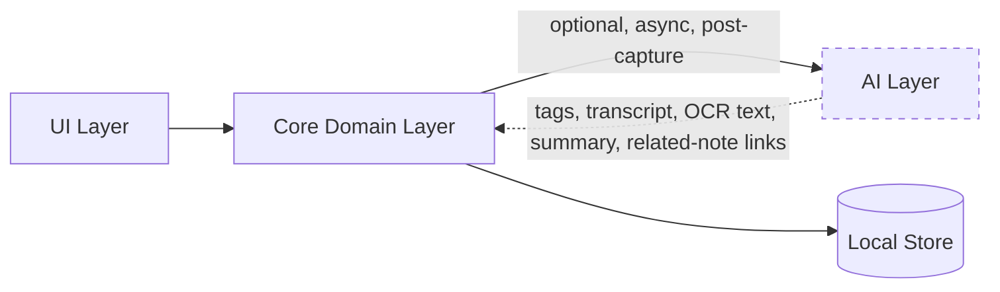

# Nex — AI Strategy

> Companion to [`01-product-vision.md`](./01-product-vision.md#ai-philosophy) and [`04-architecture.md`](./04-architecture.md#modular-architecture). This document defines exactly where AI is allowed to participate in Nex, and where it is explicitly forbidden.

**Status:** Authoritative · **Owner:** Product & Engineering · **Last updated:** 2026

---

## Guiding Rule

> **AI is optional. AI never slows down capture.**

Every AI feature in Nex must satisfy both halves of this rule simultaneously. A feature that is optional but still delays capture (e.g., waiting for an AI tag suggestion before saving) is a violation. A feature that is fast but not optional (e.g., forced transcription with no way to disable it) is equally a violation.

> Rule of thumb: **if removing all AI changes the capture experience by zero milliseconds, the design is correct.**

---

## What AI Is Allowed to Do

AI exists to reduce friction **after** capture — helping the user find, understand, or connect what they've already saved. It is never a precondition for saving.

| Capability | Description | Target Version |
|---|---|---|
| **Transcription (Speech-to-Text)** | Converts voice notes into searchable text, resolving the [v1 voice-search limitation](./02-product-specification.md#search) | v3 |
| **OCR** | Extracts text from photos so they become keyword-searchable | v3 |
| **Tagging** | Suggests optional tags for a note after it's saved | v3 |
| **Semantic search** | Finds notes by meaning/intent, complementing keyword search | v3 |
| **Summarization** | On-demand summaries of long notes or clusters of related notes | v3+ |
| **Related notes** | Surfaces connections between notes without manual organization | v3+ |

All capabilities are:
- **Post-capture only** — they run after a note already exists and is safely persisted.
- **Asynchronous** — never block the UI thread or the capture flow.
- **Dismissible** — any suggestion can be ignored with no consequence.
- **Non-destructive** — AI never overwrites or deletes original user content; it only adds metadata (tags, transcript text, OCR text) alongside it.
- **Independently toggleable** — each capability can be turned off individually, and the app remains fully functional (per the v1 MVP feature set) with all of them off.

---

## What AI Must Never Do

- ❌ Block, delay, or gate capture.
- ❌ Require a decision (title, folder, format, confirmation) at capture time.
- ❌ Send user content off-device by default.
- ❌ Become a dependency — the app must work fully with AI disabled or unavailable.
- ❌ Silently rewrite or delete user content.
- ❌ Make retrieval worse via false confidence — semantic search results must be clearly distinguishable from exact keyword matches so users can calibrate trust appropriately.
- ❌ Introduce UI complexity that slows finding.

---

## Architectural Boundary

AI lives in its own package (`packages/ai`, see [`06-development.md`](./06-development.md#folder-structure)) that the Core domain layer calls into through a well-defined, optional interface — never the reverse, and never from the UI directly.



The dashed boundary is intentional: **the AI layer can be deleted from a build entirely**, and Core, Data, and UI continue to compile and function, fully satisfying the v1 MVP. This is the architectural proof of "AI-optional," not just a policy statement.

### Provider-Agnostic Adapter Interface

A single, common interface hides the underlying model or vendor behind it. Every method is optional (`?`), so an adapter may implement any subset of capabilities — missing capabilities are simply unavailable, not errors:

```dart
abstract class AIAdapter {
  Future<Transcript>? transcribe(AudioRef audio);
  Future<Vector>? embed(String text);
  Future<List<Tag>>? suggestTags(Note note);
  Future<Summary>? summarize(Note note);
  Future<OCRText>? ocr(ImageRef image);
}
```

- **Pluggable backends:** on-device models, a self-hosted service, or a cloud provider — chosen by the user, all behind the same interface.
- **No vendor lock-in.** Swapping a model must not touch domain, storage, or UI code.
- **Default to local.** The out-of-the-box experience prefers on-device intelligence; cloud is an explicit opt-in.
- **Three wire formats, one contract.** OpenAI chat-completions, Anthropic Messages and Gemini `generateContent` share nothing but the shape of this interface — not the path, not the auth header, not the request body. Gemini in particular authenticates with `x-goog-api-key` rather than a bearer token, so it is its own provider and cannot be reached through the OpenAI-compatible "custom" option.

---

## When AI Runs, and When It Shows

These are two separate questions and the answers are deliberately different.

- **Runs: on its own, in the background.** A recording is transcribed and a long note summarised right after capture, off the capture path, and failures leave the note untouched. The user should never have to ask for the work.
- **Shows: only when asked.** A note is the user's own writing; a machine's reading of it does not get to open on top of that. The detail sheet holds everything derived — transcript, OCR text, summary, suggested tags, related notes — behind one row that names what is there. That row is also where the on-demand calls happen, so opening a note fires no request at all.
- **Backfill, because "automatic" is a promise about the library, not about a moment.** Enrichment runs at capture, and the layer is off by default, so at the instant a user turns it on every note they own was captured while nothing could read it. Without a backfill pass "automatic transcription" would quietly mean "automatic for notes captured from now on" — see FR-8b.8. The pass is bounded, sequential, and stops at the first note that yields nothing, because that is what an exhausted free-tier quota looks like from inside the app.

---

## Data & Privacy Principles for AI

- **No note content is sent anywhere by default.** Any AI processing that requires leaving the device is explicitly opt-in per feature, not a blanket toggle.
- **On-device processing is preferred** for transcription and OCR where platform capability allows it.
- **AI-derived data is clearly labeled** in the data model (e.g., a transcript is stored as `transcript_text`, distinct from the original `content`/`media_uri`), so the provenance of any searchable text is always inspectable and reversible.
- **No content is used to train models** without separate, explicit, revocable consent.
- Logging rules from [`06-development.md`](./06-development.md#logging) apply equally to AI subsystems: no note content in logs, structured metadata only.

---

## Rollout Plan

1. **v1–v2:** No AI in the product. The Timeline, capture, tags, search, and sync all prove their value on their own merits first.
2. **v3.0:** Transcription and OCR ship first, because they directly resolve a documented product gap (voice/photo notes not being keyword-searchable).
3. **v3.x:** Tag suggestions, semantic search, summarization, and related notes follow, each shipped independently and each independently toggleable.

See [`08-roadmap.md`](./08-roadmap.md#v3--the-intelligence-layer) for full sequencing.

---

## Failure Modes

| Scenario | Behavior |
|---|---|
| AI disabled by user | Everything works exactly like AI-free Nex |
| AI provider unavailable/errored | Capture/search unaffected; enrichment silently skipped/retried |
| Transcription fails for an audio note | Note remains tag/date-searchable; UI keeps the honest label |
| Cloud opt-in revoked | On-device features continue; cloud features stop; no data loss |

---

## Offline Local-Model Track (Phase 0)

A separate, later track from the rollout above: a fully local, no-API,
no-internet chat/assistant layer, running a downloadable on-device model
instead of the heuristic stub `OnDeviceAIAdapter` uses today. Full scope
(chat, tool-calling into Nex's own capabilities, a local memory/profile
store, context import from other AIs, a free/paid capability split) is
still being phased — this section only records what Phase 0 (feasibility)
has actually decided and built, so it isn't lost between sessions.

**Scope for now: Android only.** No Windows work for this track until
feasibility is proven — see [ADR-024](./10-decisions.md#adr-024--flutter-as-the-single-cross-platform-client-framework)
for why the rest of the app stays cross-platform regardless. Distribution
target is Cafe Bazaar / Myket, not Google Play, for now — Play is a later,
explicit decision, not a blocker for this track.

**Phase 0 decisions:**
- Runtime: [`llama_cpp_dart`](https://pub.dev/packages/llama_cpp_dart),
  pinned to an exact pre-1.0 dev version in `packages/ai/pubspec.yaml`
  (re-check the pin before Phase 2 commits to it — the API is still moving).
- The adapter code lives in `packages/ai`, not Core — the one package the
  [architectural boundary](#architectural-boundary) above already
  guarantees is deletable, enforced in CI by a job that deletes
  `packages/ai` and rebuilds the downstream graph.
- **`apps/client` still does not depend on `nex_ai`, and never should** —
  that same CI job also asserts nothing outside `packages/ai` imports
  `package:nex_ai/` and that `apps/client/pubspec.yaml` never lists it. A
  first attempt at this harness violated both and failed CI (PR #84) before
  this was written. Consequently, the throwaway measurement harness is its
  own standalone Flutter project — `experiments/local_ai_bench/` — outside
  both `apps/client` and `packages/`, free to depend on `nex_ai` without
  touching that guarantee. See its `README.md` and
  `android/app/libs/README.md` for the manual one-time setup (native
  library, a `.gguf` model) it needs.
- **arm64-v8a only** — the prebuilt native library this depends on ships no
  32-bit or x86_64 binary. The real feature will need a runtime ABI check
  before ever offering local AI on a device; irrelevant ABIs simply don't
  get the capability, the same way `aiCapabilities` already models "off."
- The harness answers one question — tokens/sec, time-to-first-token, peak
  memory on real hardware — before anything is designed on top of it.

---

## Success Criteria for AI Features

An AI feature ships only if all three hold:

1. It measurably improves find-time or retrieval confidence (per [Success Metrics](./01-product-vision.md#success-metrics)).
2. It introduces zero regression to capture-time performance, verified by the CI performance budget.
3. Disabling it produces no error state or missing core functionality anywhere in the app.

> In Nex, AI is a quiet assistant that tidies up **after** the idea is safely captured — never a bouncer at the door.
