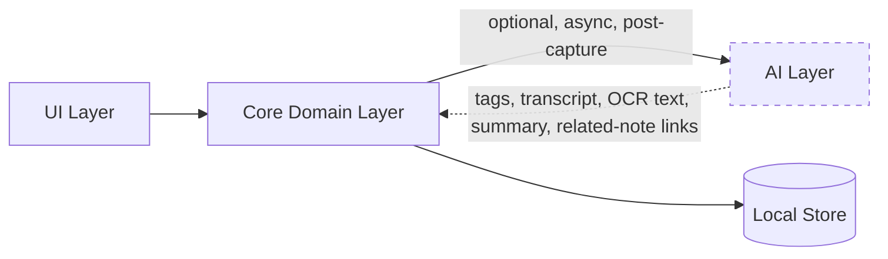

# Nex — AI Strategy

> Companion to [`01-product-vision.md`](./01-product-vision.md#ai-philosophy) and [`04-architecture.md`](./04-architecture.md#modular-architecture). This document defines exactly where AI is allowed to participate in Nex, and where it is explicitly forbidden.

**Status:** Authoritative · **Owner:** Product & Engineering · **Last updated:** 2026

---

## Guiding Rule

> **AI is optional. AI never slows down capture.**

Every AI feature in Nex must satisfy both halves of this rule simultaneously. A feature that is optional but still delays capture (e.g., waiting for an AI tag suggestion before saving) is a violation. A feature that is fast but not optional (e.g., forced transcription with no way to disable it) is equally a violation.

> Rule of thumb: **if removing all AI changes the capture experience by zero milliseconds, the design is correct.**

---

## What AI Is Allowed to Do

AI exists to reduce friction **after** capture — helping the user find, understand, or connect what they've already saved. It is never a precondition for saving.

| Capability | Description | Target Version |
|---|---|---|
| **Transcription (Speech-to-Text)** | Converts voice notes into searchable text, resolving the [v1 voice-search limitation](./02-product-specification.md#search) | v3 |
| **OCR** | Extracts text from photos so they become keyword-searchable | v3 |
| **Tagging** | Suggests optional tags for a note after it's saved | v3 |
| **Semantic search** | Finds notes by meaning/intent, complementing keyword search | v3 |
| **Summarization** | On-demand summaries of long notes or clusters of related notes | v3+ |
| **Related notes** | Surfaces connections between notes without manual organization | v3+ |

All capabilities are:
- **Post-capture only** — they run after a note already exists and is safely persisted.
- **Asynchronous** — never block the UI thread or the capture flow.
- **Dismissible** — any suggestion can be ignored with no consequence.
- **Non-destructive** — AI never overwrites or deletes original user content; it only adds metadata (tags, transcript text, OCR text) alongside it.
- **Independently toggleable** — each capability can be turned off individually, and the app remains fully functional (per the v1 MVP feature set) with all of them off.

---

## What AI Must Never Do

- ❌ Block, delay, or gate capture.
- ❌ Require a decision (title, folder, format, confirmation) at capture time.
- ❌ Send user content off-device by default.
- ❌ Become a dependency — the app must work fully with AI disabled or unavailable.
- ❌ Silently rewrite or delete user content.
- ❌ Make retrieval worse via false confidence — semantic search results must be clearly distinguishable from exact keyword matches so users can calibrate trust appropriately.
- ❌ Introduce UI complexity that slows finding.

---

## Architectural Boundary

AI lives in its own package (`packages/ai`, see [`06-development.md`](./06-development.md#folder-structure)) that the Core domain layer calls into through a well-defined, optional interface — never the reverse, and never from the UI directly.



The dashed boundary is intentional: **the AI layer can be deleted from a build entirely**, and Core, Data, and UI continue to compile and function, fully satisfying the v1 MVP. This is the architectural proof of "AI-optional," not just a policy statement.

### Provider-Agnostic Adapter Interface

A single, common interface hides the underlying model or vendor behind it. Every method is optional (`?`), so an adapter may implement any subset of capabilities — missing capabilities are simply unavailable, not errors:

```dart
abstract class AIAdapter {
  Future<Transcript>? transcribe(AudioRef audio);
  Future<Vector>? embed(String text);
  Future<List<Tag>>? suggestTags(Note note);
  Future<Summary>? summarize(Note note);
  Future<OCRText>? ocr(ImageRef image);
}
```

- **Pluggable backends:** on-device models, a self-hosted service, or a cloud provider — chosen by the user, all behind the same interface.
- **No vendor lock-in.** Swapping a model must not touch domain, storage, or UI code.
- **Default to local.** The out-of-the-box experience prefers on-device intelligence; cloud is an explicit opt-in.
- **Three wire formats, one contract.** OpenAI chat-completions, Anthropic Messages and Gemini `generateContent` share nothing but the shape of this interface — not the path, not the auth header, not the request body. Gemini in particular authenticates with `x-goog-api-key` rather than a bearer token, so it is its own provider and cannot be reached through the OpenAI-compatible "custom" option.

---

## When AI Runs, and When It Shows

These are two separate questions and the answers are deliberately different.

- **Runs: on its own, in the background.** A recording is transcribed and a long note summarised right after capture, off the capture path, and failures leave the note untouched. The user should never have to ask for the work.
- **Shows: only when asked.** A note is the user's own writing; a machine's reading of it does not get to open on top of that. The detail sheet holds everything derived — transcript, OCR text, summary, suggested tags, related notes — behind one row that names what is there. That row is also where the on-demand calls happen, so opening a note fires no request at all.
- **Backfill, because "automatic" is a promise about the library, not about a moment.** Enrichment runs at capture, and the layer is off by default, so at the instant a user turns it on every note they own was captured while nothing could read it. Without a backfill pass "automatic transcription" would quietly mean "automatic for notes captured from now on" — see FR-8b.8. The pass is bounded, sequential, and stops at the first note that yields nothing, because that is what an exhausted free-tier quota looks like from inside the app.

---

## Data & Privacy Principles for AI

- **No note content is sent anywhere by default.** Any AI processing that requires leaving the device is explicitly opt-in per feature, not a blanket toggle.
- **On-device processing is preferred** for transcription and OCR where platform capability allows it.
- **AI-derived data is clearly labeled** in the data model (e.g., a transcript is stored as `transcript_text`, distinct from the original `content`/`media_uri`), so the provenance of any searchable text is always inspectable and reversible.
- **No content is used to train models** without separate, explicit, revocable consent.
- Logging rules from [`06-development.md`](./06-development.md#logging) apply equally to AI subsystems: no note content in logs, structured metadata only.

---

## Rollout Plan

1. **v1–v2:** No AI in the product. The Timeline, capture, tags, search, and sync all prove their value on their own merits first.
2. **v3.0:** Transcription and OCR ship first, because they directly resolve a documented product gap (voice/photo notes not being keyword-searchable).
3. **v3.x:** Tag suggestions, semantic search, summarization, and related notes follow, each shipped independently and each independently toggleable.

See [`08-roadmap.md`](./08-roadmap.md#v3--the-intelligence-layer) for full sequencing.

---

## Failure Modes

| Scenario | Behavior |
|---|---|
| AI disabled by user | Everything works exactly like AI-free Nex |
| AI provider unavailable/errored | Capture/search unaffected; enrichment silently skipped/retried |
| Transcription fails for an audio note | Note remains tag/date-searchable; UI keeps the honest label |
| Cloud opt-in revoked | On-device features continue; cloud features stop; no data loss |

---

## Offline Local-Model Track

A separate, later track from the rollout above: a fully local, no-API,
no-internet chat/assistant layer, running a downloadable on-device model
instead of the heuristic stub `OnDeviceAIAdapter` uses today. This section
phases that full scope — chat, tool-calling into Nex's own capabilities, a
local memory/profile store, context import from other AIs, a free/paid
capability split — so the plan isn't lost between sessions. Phase 0 is
built and done; Phase 1 is next; Phase 2's technical foundation (contract,
schema, gating hook) is designed and scaffolded now, ahead of the chat
loop that will drive it, because none of it depends on the still-pending
on-device benchmark (see Phase 0 below).

**Scope for now: Android only.** No Windows work for this track until
feasibility is proven — see [ADR-024](./10-decisions.md#adr-024--flutter-as-the-single-cross-platform-client-framework)
for why the rest of the app stays cross-platform regardless. Distribution
target is Cafe Bazaar / Myket, not Google Play, for now — Play is a later,
explicit decision, not a blocker for this track.

### Free vs. Paid Boundary

The whole track sits behind one product rule: **general-purpose chat is
free forever; the "personal assistant" layer built on top of it is the
paid tier.** Concretely:

| Free (everyone, forever) | Paid ("personal assistant" tier) |
|---|---|
| General chat — Q&A, math, writing help, translation, summarization, idea generation | Long-term/personal memory, gradual profile learning |
| The existing online capabilities (transcription, OCR, tag suggestion, summarization) once they gain a local-model backend | Behavioral-pattern learning |
| — | Task/reminder execution |
| — | Deep tool-calling into Nex's own capabilities (create/edit notes, tagging, search) |
| — | Cross-AI context import |

A request that exceeds chat's scope ceiling (e.g., "build me a full
app") must be told explicitly that it's out of scope for Nex — never
answered partially or at excessive length. See
[ADR-030](./10-decisions.md#adr-030--freepaid-boundary-for-the-personal-assistant-tier-gated-by-a-structural-entitlement-hook)
for why the boundary sits exactly here and how it's gated in code.

### Phase 0 — Feasibility (done)

- Runtime: [`llama_cpp_dart`](https://pub.dev/packages/llama_cpp_dart),
  pinned to an exact pre-1.0 dev version in `packages/ai/pubspec.yaml`
  (re-check the pin before Phase 2 commits to it — the API is still moving).
- The adapter code lives in `packages/ai`, not Core — the one package the
  [architectural boundary](#architectural-boundary) above already
  guarantees is deletable, enforced in CI by a job that deletes
  `packages/ai` and rebuilds the downstream graph.
- **`apps/client` still does not depend on `nex_ai`, and never should** —
  that same CI job also asserts nothing outside `packages/ai` imports
  `package:nex_ai/` and that `apps/client/pubspec.yaml` never lists it. A
  first attempt at this harness violated both and failed CI (PR #84) before
  this was written. Consequently, the throwaway measurement harness is its
  own standalone Flutter project — `experiments/local_ai_bench/` — outside
  both `apps/client` and `packages/`, free to depend on `nex_ai` without
  touching that guarantee. See its `README.md` and
  `android/app/libs/README.md` for the manual one-time setup (native
  library, a `.gguf` model) it needs.
- **arm64-v8a only** — the prebuilt native library this depends on ships no
  32-bit or x86_64 binary. The real feature will need a runtime ABI check
  before ever offering local AI on a device; irrelevant ABIs simply don't
  get the capability, the same way `aiCapabilities` already models "off."
- The harness answers one question — tokens/sec, time-to-first-token, peak
  memory on real hardware — before anything is designed on top of it. This
  still requires a physical Android device and is not yet done; it gates
  go/no-go for shipping Phase 1 inside the real app, not the design work
  in Phase 1/2 below.

#### Why the measurement has not happened

Not for want of code. Three artifacts have to meet on one device and none of
them arrives on its own:

1. **A bench APK.** No CI job builds `experiments/local_ai_bench` — not in
   `ci.yml`, not in `release.yml`. The only route is `flutter run` from a
   local toolchain, which is not how this project's builds normally reach a
   phone. A first attempt at the measurement stalled here: there was never an
   APK to install.
2. **`llama-cpp-dart.aar`**, from GitHub release assets — needed on the
   *build machine*, not the phone.
3. **A `.gguf`, 1–2.5 GB**, from Hugging Face — needed on the phone.

**(2) and (3) are also a product problem, not only a testing one.** The
distribution target is Cafe Bazaar, so the people who would use this feature
face the same download that blocks the test. "Where does the model come from,
for a user in Iran" has to be answered before Phase 1 can ship at all, and
the honest answer is probably that Nex hosts or mirrors the weights itself
rather than pointing at Hugging Face. That is real work, and it belongs to
Phase 1 rather than to this benchmark.

#### The measurement, without building anything

The bench harness uses `llama_cpp_dart`, which is llama.cpp. Any other
llama.cpp-backed Android app running the same quantization on the same
silicon produces the same number to within a few percent — so a go/no-go
does not require our own APK, and getting it that way costs no build and no
CI minutes.

[PocketPal AI](https://github.com/a-ghorbani/pocketpal-ai) (open source,
Android and iOS) is the practical choice: it loads any GGUF, and it has a
built-in benchmark that reports tokens/sec and memory directly, so nothing
has to be timed by hand.

Measure, in this order:

1. A **~3B instruct model at Q4_K_M** — the size Phase 1 would actually want.
2. A **~1B instruct model at Q4_K_M** — the fallback, if 3B does not clear
   the bar.

For each: tokens/sec, time-to-first-token, peak memory, the device model and
its total RAM. Then run the same prompt **five times back to back** and record
tokens/sec for each run — thermal throttling only shows up as a decline
across runs, never in a single number, and a phone that starts at 20 tok/s
and settles at 9 is a phone this feature does not run on.

#### Go / no-go, decided in advance

Written before the numbers exist, so the numbers cannot be argued into a
"yes". A local model is worth shipping when generation outruns reading —
roughly 7–11 tokens/sec is ordinary reading speed, and below that the answer
visibly lags the reader.

| | Bar |
|---|---|
| **Go** | 3B-Q4 at **≥12 tok/s** sustained, TTFT **< 2 s**, peak RSS **< 45%** of device RAM, and **< 20%** tokens/sec lost across five consecutive runs |
| **Conditional go** | 3B misses, but 1B-Q4 clears every bar. Ship Phase 1 on a 1B — which realistically means chat and tag suggestion, not summarization worth reading |
| **No-go** | 1B under ~8 tok/s, or more than ~30% lost to heat. The track stops; the online provider path already works and stays the answer |

A "conditional go" is not a smaller version of "go": a 1B model changes what
Phase 1 can honestly claim, and the Free vs. Paid table above would need
re-reading against what it can actually do.

#### Measured so far — 1B only, on one device

Nothing A063, Android 35, 8 cores, 11 GB RAM. PocketPal's built-in benchmark,
`PP 512 · TG 128 · PL 1 · Rep 3`, all layers offloaded.

| gemma-3-1b-it | size | token generation | prompt processing |
|---|---|---|---|
| `q4_0` | 714 MB | 11.73 t/s | **93.14 t/s** |
| `q4_k_m` | 800 MB | 11.75 t/s | 53.04 t/s |

Peak memory 1 GB of 12 in both — a non-issue at this size.

**`q4_0` wins outright on this hardware** and is what a shipped 1B should use:
smaller file, identical generation, and 76% faster prefill. Generation being
flat across the two is expected — it is bound by memory bandwidth, and both
files stream a similar number of bytes per token — while prefill is compute
bound, which is where the two quantizations actually differ.

**Prefill is the weak result, and it is easy to miss.** `PP 512` means a
512-token prompt, so time-to-first-token is 512 ÷ 93 = **5.5 s** for `q4_0`
and 9.7 s for `q4_k_m` — against a 2 s bar. (The totals confirm the reading:
3 × (5.5 + 128/11.73) = 49.2 s, reported as 49 s; 3 × (9.65 + 128/11.75) =
61.6 s, reported as 1 m 2 s.)

That splits the track cleanly:

- **Phase 1 chat is viable.** A typed question is 20–50 tokens, so prefill is
  under a second and generation at 11.7 t/s outruns reading.
- **Anything that sends notes as context is not.** Twenty notes is roughly
  2 000 tokens, which is ~20 s of silence before the first word appears. The
  daily digest, "ask about this note", and the whole Phase 2 assistant are in
  that category. On this hardware they stay on the online provider.

**Still missing:** the 3B measurement (the primary one — the two runs above are
two quantizations of the fallback), and the five-consecutive-run thermal check.
`Rep: 3` in the benchmark config averages within one run; it does not show
decline across runs, which is the only place throttling appears.

**Prediction, recorded before the 3B runs**, so it can be wrong on the record:
token generation is bandwidth-bound, and a 3B at `q4_0` is ~1.8 GB against this
714 MB — about 2.5× the bytes per token. Expect **4–6 t/s**, under the 8 t/s
floor. If that holds, the answer is "1B or nothing", and the 3B run is worth
doing to close the question rather than to open it.

#### Measured — the 3B, and the verdict

`qwen2.5-3b-instruct-q4_0`, 1.99 GB, same device and benchmark config:
**29.57 t/s prompt processing, 5.40 t/s generation**, peak memory 2 GB of 12.
(Again reconciled: 3 × (512/29.57 + 128/5.40) = 123 s, reported as 2 m 3 s.)

The prediction was 4–6 t/s and the answer is 5.40. **3B is out.** Not "slow" —
5.4 t/s is below the speed a person reads at, so the answer trails the eye the
whole way down. Doubling the model to buy that is not a trade worth making.

**The device is the floor, not the ceiling.** SM7325 — a 2021 mid-range
Snapdragon — reporting `I8MM: ✗` and `SVE: ✗`. I8MM is the ARM instruction that
accelerates the int8 matrix multiplies quantized inference leans on, and its
absence is most of why prompt processing is as low as it is. A current flagship
would roughly double these numbers. Cafe Bazaar's audience skews to this class
of device though, so it is a fair representative rather than a worst case.
`arm64-v8a` is present, so the AAR's ABI requirement is satisfied.

**Verdict: conditional go.**

- **Phase 1 local chat ships on a 1B at `q4_0`.** The 5.5 s TTFT above is
  against the benchmark's 512-token prompt; a typed question is 20–50 tokens,
  so real TTFT is ~0.3 s, and 11.7 t/s outruns reading.
- **Nothing that sends notes as context ships locally, at any model size.**
  That is a prompt-processing limit, not a model-size one, and both sizes fail
  it. The digest, "ask about this note" and the Phase 2 assistant stay on the
  online provider.

#### The second gate, which no benchmark answers

Speed is settled. **Quality is not**, and for this project it is the harder
bar: a 1B model's Persian is typically poor, and Nex's primary user writes in
Persian. A benchmark cannot report that.

Before Phase 1 gets any implementation effort, someone has to sit with
`gemma-3-1b-it-q4_0` in PocketPal, chat with it **in Persian**, and judge
whether the answers are worth shipping under the app's name. If they are not,
the speed result is irrelevant and the track stops there instead of after the
runtime is wired in.

If Persian is the thing that fails, **Qwen2.5-1.5B-Instruct at `q4_0`** (~1 GB)
is the next candidate rather than a return to 3B: better multilingual coverage,
and interpolating from these two measurements it should land near 8–9 t/s —
still above reading speed.

**Still outstanding:** the five-consecutive-run thermal check on whichever 1B
is chosen. It is the last unknown in the speed half of the decision.

#### The quality gate — `gemma-3-1b-it-q4_0` fails it

Seven prompts covering what Phase 1 actually claims — a fact, arithmetic, a
rewrite, a summary, a translation, idea generation, and one question it should
refuse. Asked in Persian, default settings, first answer taken. **None passed
cleanly.**

| Asked | Answer | Why it fails |
|---|---|---|
| Capital of Japan, one sentence | "It could be Tokyo." | Right, but hedged on a fact that is not a guess |
| 3 × 45,000 − 20,000 | `45000 + 20000 - 30000 = 35000` | Correct answer is 115,000. Dropped the quantity, *added* the discount, invented a third number |
| Make a line more polite | Stayed colloquial | Asked for formal register, did not raise it; also turned a conditional into an assertion |
| Summarise a day's notes | Truncated mid-sentence | And said someone helped, which nobody in the text did |
| EN→FA, "moved to Thursday morning" | "اتاق الاجتماع", "به شنیده شد", "فردا" | Arabic not Persian, meaningless clause, wrong day. Offered two variants instead of translating |
| Three short app names | `۱. ز`, then two English names | One Persian letter as a name; answered a Persian question in English; trailing fragment |
| Today's dollar rate | Disclaimed, then "1.2877 dollars" with two **fabricated** source URLs | The disclaimer was right and it invented data and citations anyway |

Three answers stop mid-sentence, which may be PocketPal's token cap rather than
the model — but it rescues none of them, because what came before the cut was
already wrong in all three.

Speed matched the benchmark exactly: 11.8–14.2 t/s, TTFT 0.3–1.5 s. **Speed was
never the problem.** Two of these failures — the summary and the translation —
are features already shipped against the online provider, so the comparison is
not hypothetical.

#### What the two gates together actually say

The results form a squeeze rather than a threshold:

- **3B** may be good enough, but 5.4 t/s is slower than reading — unusable.
- **1B** is comfortably fast, and its Persian is not publishable.

The sizes this hardware runs well are not good enough; the sizes that are good
enough it cannot run. That is a stronger argument against the whole track than
either measurement alone, and it should be read as one.

**One candidate remains in the gap: `Qwen2.5-1.5B-Instruct` at `q4_0`** (~1 GB).
Qwen's multilingual coverage is materially better than Gemma's at this size, and
interpolating the two measurements puts it near 8–9 t/s, still above reading
speed. The same seven prompts decide it.

If it also fails, the honest conclusion is that **local Persian chat is not
achievable at the sizes this class of device can run**, and this track closes
rather than continuing into implementation. The online provider already works
and would remain the answer. That outcome is worth stating plainly in advance
so it can be accepted rather than argued around.

#### `Qwen2.5-1.5B-Instruct-Q4_0` — worse than the 1B, not better

| Asked | Answer |
|---|---|
| Capital of Japan | "Tokyo" — correct, but answered in English |
| 3 × 45,000 − 20,000 | «پس باید ۳۵ هزار تومان را خریم.» — the same wrong 35,000 as Gemma, and `خریم` is not a verb form |
| Make a line more polite | «با سرعت ببخشید، کارت را امتحان زده و خواهش می‌کنم مشکل‌ها را تحلیل کنید.» — unrelated to the input sentence |
| Summarise a day's notes | «متأسفم، در حال‌بار می‌توانم با سر راه برگشت نان گرفتم…» — an apology that is not in the text, and `حال‌بار` is not a word |
| EN→FA translation | «تمونیک روز دوشنبه تغییر کرده و زمینه تغییر یافت.» — `تمونیک` is not a word, Monday for Thursday, "background" for "room" |

Speed was again fine (10.6–11.8 t/s). Two independent models in the same size
class, one clearly worse than the other, both unusable.

#### Going bigger is already answered — by arithmetic, not by another test

The obvious next instinct is a 4B. It does not need measuring, because
generation is bandwidth-bound and two points on that line are already known:

| | size (q4_0) | generation |
|---|---|---|
| gemma-3-1b | 0.71 GB | 11.7 t/s |
| qwen2.5-3b | 1.99 GB | 5.40 t/s |
| **a 4B** | ~2.5 GB | **~3.5–4.3 t/s** (interpolated) |

The 3B was rejected at 5.40 t/s for being slower than reading. A 4B is slower
still. **Bigger is the direction already measured and closed** — there is no
version of this where more parameters fit on this device.

That leaves exactly one axis: **newer at the same size**. `Qwen2.5` is a
generation behind — `Qwen3` covers 119 languages and `Qwen3.5` claims 200+,
and multilingual coverage is precisely what failed here. `Qwen3-1.7B` at
`q4_0` is ~1.0 GB, which interpolates to roughly 8 t/s — still above reading
speed, unlike anything larger.

**This is the last test.** Same seven prompts. If a current-generation model
built for multilingual work cannot write publishable Persian at a size this
device can run, the constraint is the size, not the model, and the track
closes. A Persian-specific fine-tune of a small base would be the only thing
left to look at after that, and its availability as GGUF has not been checked
here — it is a direction, not a plan.

### Correction — the benchmark measured the wrong runtime

**Everything above is a measurement of llama.cpp on the CPU, and it was read as
if it measured the device.** It did not. The runtime was pinned in Phase 0 to
`llama_cpp_dart`, whose Android AAR is a CPU build, and that pin was never
treated as an assumption worth testing. The "squeeze" conclusion — fast enough
is not good enough, good enough is not fast enough — is an artefact of that
choice, not a property of the hardware.

What surfaced it: Google's **AI Edge Gallery** running `Gemma-4-E2B-it` (2.6 GB)
on this same phone, comfortably, through **LiteRT-LM** rather than llama.cpp.

| Gemma 4 E2B, Android | decode |
|---|---|
| CPU | 2–5 t/s |
| **GPU (OpenCL), LiteRT-LM** | **~52 t/s** |

The CPU figure agrees with what was measured here (5.40 t/s for a 2 GB model),
which is the point: **the data was never wrong, it was scoped to one path.**
The device information screen reported `OpenCL Support: ✓` on an Adreno 642L,
so the GPU path was open the whole time and nothing here was running on it.

LiteRT-LM also uses a Gemma-4-specific mixed 2/4/8-bit quantization: text-only
weights can sit near 0.8 GB in memory, with the embedding parameters memory
mapped rather than resident.

**There is a Flutter path, and it is current.** `flutter_gemma` (v1.6.5,
published within a day of this being written, verified publisher) runs Android
`.litertlm` models over FFI with GPU acceleration on arm64-v8a; `flutter_litert_lm`
is a second option. This is not a research direction — it is a maintained
package.

**What survives and what changes.** `ChatAdapter` was built as a contract that
does not know what is behind it, and that is exactly what it buys here: the
Phase 1 scaffolding, the flavor, the entry point and the CI invariant all
stand. What changes is the implementation behind the seam and the dependency —
`llama_cpp_dart` leaves `packages/ai`, and the Phase 0 pin goes with it.

**What is still unproven.** Speed is now plausible, not demonstrated: the 52 t/s
is Google's figure on some Android device, not a measurement on this one. And
**the quality gate has not moved** — Gemma 4 E2B is a far more capable model
than `gemma-3-1b`, which is real cause for optimism and not evidence. The same
seven Persian prompts decide it, run in Edge Gallery, alongside the tokens/sec
that app reports on this actual phone.

**And the distribution problem got worse, not better.** 2.6 GB against the
714 MB considered earlier. Whatever answers "where does a user in Iran get the
weights" has to answer it at that size.

### Both gates pass — `Gemma-4-E2B-it` on GPU

Run in AI Edge Gallery on the same Nothing A063, header reporting
`Model on GPU`.

**The dollar question is the one that matters**, because it is exactly where
`gemma-3-1b` produced a fabricated rate and two invented source URLs. Gemma 4
declined cleanly: no number, no citations, natural formal Persian, and an
accurate statement that it has no live market data. For a notes app, that
single answer is worth more than the rest of the set.

**The naming question passes with one caveat.** Fluent, grouped, structurally
sensible Persian with no coined non-words — a different universe from
`۱. ز (Simple, concise, and direct)`. But it was asked for three names and gave
seven, and took 30.3 s doing it. Minor semantic slips in the parenthetical
glosses (`Spark (شعله‌زنی/نخله)` is not meaningful) sit within tolerance.

**Verbosity is the real defect, and it is one this app already has tools for.**
`AiAnswerLength` and `nexChatScopeCeilingPrompt` exist precisely to bound
answer length; they were written against the online provider and apply
unchanged here.

**Speed on this device, from wall-clock response times:** roughly **13–20 t/s**
— about 9.4 s for a ~150–200 token answer, 30.3 s for a long one. Not the 52
t/s Google reports, which will have been a flagship; comfortably above the 7–11
t/s reading speed that matters. **Both gates are passed on measurement rather
than impression.**

### Phase 1, re-planned on LiteRT-LM

The decision is a go, and the shape of the work changes from what Phase 1
describes above:

| | was | is |
|---|---|---|
| runtime | `llama_cpp_dart` (CPU) | `flutter_gemma` → LiteRT-LM (GPU, CPU fallback) |
| format | `.gguf` | `.litertlm` |
| model | undecided 1–4B | `Gemma-4-E2B-it`, 2.6 GB |
| native setup | hand-placed AAR, never committed | a maintained pub package |

What carries over untouched: `ChatAdapter`, `ChatMessage`, `ChatResponse`,
`ChatAdapterBinding`, `chat_scope_policy.dart`, the `ai` flavor, `main_ai.dart`,
and the `ai-deletion-proof` CI invariant. The seam was built so the thing behind
it could be replaced, and this is that.

Work this actually needs, in dependency order:

1. **Swap the dependency — done.** `llama_cpp_dart` out of `packages/ai`,
   **`flutter_litert_lm`** in, `experiments/local_ai_bench` deleted along with
   the AAR instructions it needed.

   **Not `flutter_gemma`, for a hard reason rather than a preference.** It is
   the more mature package but requires **Dart ≥ 3.12**, against the **3.9.2**
   this repo pins in `.fvmrc`. Upgrading the SDK is its own project — `.fvmrc`,
   CI's hardcoded `sdk: "3.9.0"`, every package's `environment:`, and eleven
   months of framework changes against a shipping app — and it would block all
   of Phase 1 behind it. `flutter_litert_lm` 0.3.0 resolves on the current SDK
   and wraps the same runtime. It is younger and carries more risk;
   `ChatAdapter` is what bounds that risk to one file if the SDK moves later.

   The plugin merges its own `<uses-native-library>` entries for `libOpenCL.so`
   into the host manifest, all `required="false"` — so `apps/client` needs no
   manifest change, and a device without OpenCL still installs and falls back
   to CPU.
2. **A real `ChatAdapter` — done.** `LiteRtChatAdapter`
   (`packages/ai/lib/src/litert_chat_adapter.dart`), written against the
   resolved package source and checked by the analyzer against the real API
   rather than against a summary of it.

   Three decisions in it are worth knowing. **NPU is never selected** — fastest
   where it exists, native crash where it does not, and a chat feature should
   not make that trade; GPU then CPU, CPU always last so a floor always
   remains. **The scope ceiling goes into LiteRT-LM's `systemInstruction`
   slot** rather than into the transcript. And **the conversation is reused
   across calls**: `ChatAdapter` passes the whole history every time, and
   replaying it would re-run prefill over the entire transcript on every
   message — the expensive half on this hardware, growing with the
   conversation — so the adapter feeds only what is new and rebuilds only when
   the history stops extending what it already holds.

   `PlaceholderLocalChatAdapter` stays bound until model management exists, so
   the `ai` flavor is never left with nothing behind `ChatAdapterBinding`.

   **`packages/ai` carries Flutter now.** It moved out of CI's Dart-only matrix
   into its own `flutter-ai-package` job and was added to the `ci-green` gate;
   that matrix proves `core` and `data` need no Flutter, which `nex_ai` never
   claimed. `ai-deletion-proof` is unaffected and was re-verified by hand in a
   worktree: deleting the package and its two integration points still leaves
   `apps/client` resolving and analyzing clean.
3. **Model file management — done.** `NexModelStore`
   (`apps/client/lib/platform/model_store.dart`), built **on**
   `UpdateDownloader` rather than beside it. That class already does
   Range-resumed downloads, `Content-Range` handling, SHA-256 verification, and
   the distinction between a truncated file worth resuming and a corrupt one
   worth deleting; a second implementation would have been a second set of the
   same bugs. Its installer sweep is scoped to `Nex-*.{apk,exe}`, so it never
   touches model parts.

   Two digests, not one: each part is verified as it lands, and the joined file
   is verified again. They answer different questions — the parts prove each
   download arrived intact, the whole proves they were reassembled in the right
   order — and the failure modes get different treatment. A corrupt *part* is
   deleted, because re-downloading is the only fix. A bad *join* keeps every
   part, because the bytes are fine and a retry should cost disk time rather
   than 2.6 GB of someone's data.

   The join writes through a staging file. Straight to the target, an interrupt
   halfway would leave a file of the right name and the wrong length, which
   `isInstalled` would call installed and LiteRT-LM would fail to load with
   nothing pointing at why. Parts are deleted only after the whole file
   verifies and is in place — before that line they are what a resume is made
   of, after it they are pure duplication.

   `installedBytes` counts parts as well as the finished file. A half-finished
   install is invisible in a file listing and very visible in a storage figure,
   and reporting one without the other is why people conclude an app is lying
   to them.

   **The release is a constant, not code.** `NexModels.gemma4E2B` carries the
   URLs, digests, size and licence, and ships with those fields empty on
   purpose: `installable` returns false while they are, so nothing offers a
   download that would 404. Publishing the weights is an edit to that constant.
4. **Device gating — done.** `LocalAi.check`
   (`apps/client/lib/platform/local_ai_support.dart`) returns a reason rather
   than a boolean: platform, architecture, storage, or not-yet-published. It
   follows the rule `aiCapabilities` already set — a capability the device
   cannot honour is *absent*, not present-and-failing — because a 2.6 GB
   download that cannot load afterwards fails at the most expensive possible
   moment.

   Storage is checked against **twice** the model plus half a gigabyte: the
   join holds the parts and the assembled file at once, so the peak is double
   the final size. Unknown free space is treated as permissive — a storage API
   that declines to answer should not cost someone a feature their phone can
   actually run, and the download fails loudly and resumably if it turns out
   not to fit.
5. **The UI — done.** `LocalModelScreen`
   (`apps/client/lib/screens/local_model_screen.dart`), reached from Settings ›
   Intelligence, plus the binding in `main_ai.dart`.

   **The licence acceptance is a gate, not a link.** The download button is
   disabled until the terms are ticked, the required notice sentence is shown
   verbatim rather than paraphrased, and the acceptance is recorded per model
   (`NexPreferences.acceptedModelLicense`) — keyed by model id, because
   accepting Gemma's terms says nothing about a different model under a
   different licence. That order is the licence condition rather than a
   usability preference.

   The Settings row appears only when `LocalAi.flavorSupportsLocalModels` is
   set, which only `main_ai.dart` does. The standard flavor has no runtime that
   could load these weights, and offering the download there would spend
   someone's 2.6 GB on a file nothing in that build can open.

   `main_ai.dart` binds `LiteRtChatAdapter` whether or not the weights are
   present. The adapter reports unavailable — a null Future, the convention
   every `AIAdapter` method uses — until the file exists, which is the
   placeholder's old job done honestly instead of with a canned sentence.

   One bug the tests found rather than a phone: the screen resolved its store
   before checking support, so on any host where the support directory cannot
   be resolved it spun forever. Support is checked first now, and a storage
   failure renders as an ordinary blocker — a screen that never resolves is the
   one failure a user cannot even describe.

**What remains before this ships:** the weights themselves. `NexModels.gemma4E2B`
is a constant with empty URLs and digests, `installable` is false while it is,
and filling it in is the only code change left.

#### Where the weights come from — decided

**Downloading from Hugging Face inside the app is not an option**, for three
separate reasons, any one of which is enough:

1. **Gemma is a gated model.** The license has to be accepted before the
   weights can be fetched, which means the request carries a Hugging Face
   token. Shipping one inside the app is the exact pattern this repository
   already rejected for its own private releases — see the note at the top of
   `release.yml` about a token "anyone could pull back out of it".
2. **Reachability.** `huggingface.co` is blocked from the network this project
   is developed on, and from the network its users are on. A silent background
   download would silently fail for the people it was built for.
3. A download the user cannot see is a download they cannot retry, resume from
   another network, or work around.

**So Nex hosts the weights**, and the license permits that — with conditions
that are not optional:

- a `NOTICE` file carrying the exact text *"Gemma is provided under and subject
  to the Gemma Terms of Use found at ai.google.dev/gemma/terms"* must accompany
  the distribution;
- every recipient must be given a copy of the agreement;
- the use restrictions must flow down as an enforceable provision.

**In practice that is a UI requirement, not paperwork: the app has to show the
Gemma terms and take an explicit acceptance before the download starts.** It
belongs in item 5 above, and it is a gate rather than a screen that can be
skipped.

**Where it is hosted: the existing public releases repository.** It is already
what the in-app updater downloads APKs from, so it is already reachable, already
public, and needs no token. It is also free, which matters — paid hosting is not
available to this project.

**One constraint shapes the work: GitHub caps a release asset at 2 GiB.** The
general `gemma-4-E2B-it.litertlm` is 2.6 GB, so it ships **split across two
assets** (a release accepts up to 1000), with the app fetching both, verifying
SHA-256 per part and over the joined file, and concatenating. `app_update.dart`
already does resumable download with SHA-256 verification, so joining parts is
the only genuinely new piece — this reuses a path that already works rather than
building a second downloader.

`litert-community` also publishes `gemma-4-E2B-it-gpu.litertlm` at 2.01 GB,
which fits under the cap as a single asset. **It was tried and it does not
work.** It is a backend-specific artifact, it is not in `flutter_litert_lm`'s
own curated set, and on a real phone loading it took the app down in native
code — where Dart has nothing to catch and the app is simply gone. It was
picked because it avoided splitting the file, which is a packaging
convenience and was never a reason to ship a model that does not load. The
shipped file is `gemma-4-E2B-it.litertlm`, 2,583,085,056 bytes, split in two:
the plugin curates that exact file and size, and it is the artifact the seven
Persian prompts were run against in the first place.

That failure produced a second, more durable change. A backend that aborts the
process cannot be caught, so `LiteRtChatAdapter` now writes down which backend
it is about to try *before* trying it, and clears the note on success. A marker
still present on a later run means that backend crashed, and it is skipped from
then on. Without it, the one action a user most wants to repeat — open the app
and ask again — is the action that kills it every time.

**A note on the test pointer.** `NexModels.gemma4E2B` currently carries the
Hugging Face URL directly, because the weights are already there and a download
that costs nothing to arrange proves the whole pipeline — support check, licence
gate, resumable fetch, verification, engine load — before any upload work is
done. It cannot ship that way: Hugging Face is not reachable from Iran, which is
the audience this feature exists for. The URL becomes the self-hosted release
asset before release, and that is the only line that changes.

The digest and size are the ones measured on the downloaded file
(2,008,432,640 bytes), so the constant is complete and the feature is live on a
supported device. Two things about that URL are worth knowing before the first
run: Hugging Face answers `resolve/` with a redirect to a CDN, and the resume
path depends on that CDN honouring `Range`. Both are ordinary, neither could be
checked from CI — the sandbox cannot reach the host — so the first real download
is also the test of them. A server that ignores `Range` costs a restart, not a
corrupt file: the digest is checked either way.

### Phase 1 — Local Chat Core (free)

- Wires the local runtime into the real app (not the throwaway harness) as
  a general-purpose chat surface: open-ended Q&A, math, writing/editing
  help, translation, summarization, idea generation.
- Scope ceiling, not topic restriction: any request within a reasonable
  length/complexity budget is answered; a request that exceeds it (e.g.,
  "write me a complete application") gets an explicit "this is outside
  Nex's current scope" — never a truncated or degraded attempt.
- No tool-calling into Nex's own capabilities, no memory/profile — those
  are Phase 2, and per the boundary above, paid.
- Still Android/arm64-v8a only, gated on the Phase 0 benchmark result.
- **Independent, lower-effort side item:** the *existing* online-only
  capabilities (transcription, OCR, tag suggestion, summarization) can
  gain a local-model-backed `AIAdapter` implementation once this runtime
  exists — they already have the adapter seam (`AIAdapter`,
  `OnDeviceAIAdapter`), so this is a new implementation, not a new
  contract. Per the Free vs. Paid table above, these must stay free when
  they do.

**Status:** the contract is scaffolded; wiring it into a shippable app is
not. `ChatAdapter`/`ChatMessage`/`ChatResponse`/`ChatAdapterBinding`
(`packages/core/lib/ai/chat_adapter.dart`,
`chat_adapter_binding.dart`) mirror `AIAdapter`'s shape and nullable-method
convention exactly, kept as a separate interface because chat is
freestanding/multi-turn where every `AIAdapter` method derives metadata
from one already-saved note. `chat_scope_policy.dart` holds the scope
ceiling as a system-prompt instruction (`nexChatScopeCeilingPrompt`) plus
a token-count backstop (`nexChatMaxResponseTokens`), on the reasoning that
the model itself is better placed to judge "does this request fit" than
any pre-filter Nex could write.

**Resolved** ([ADR-031](./10-decisions.md#adr-031--local-ai-ships-as-an-android-build-flavor-of-appsclient-not-a-separate-app)):
a real on-device implementation binds through a
second Android build flavor of `apps/client` itself, `"ai"`, alongside the
existing default (`"standard"`) — not a wholly separate app. Only
`apps/client/lib/main_ai.dart`, the `"ai"` flavor's Dart entry point, may
import `package:nex_ai/`; `apps/client/pubspec.yaml` lists `nex_ai` for
that one reason. The `ai-deletion-proof` CI job's invariant is narrowed to
match: deleting `packages/ai` now also means deleting `main_ai.dart` and
its one `pubspec.yaml` dependency line — three coupled, scripted edits
instead of a single `rm -rf`, still fully CI-enforced. `main_ai.dart`
currently binds `PlaceholderLocalChatAdapter` (`packages/ai`), which
returns a fixed "not wired up yet" response — this proves the
flavor→entry-point→`nex_ai`→`ChatAdapterBinding` pipeline compiles
end-to-end without pretending a real model exists yet. The `"ai"` flavor
is deliberately not built in any CI job yet — no real functionality sits
behind the placeholder to justify the extra Actions minutes.
`apps/client`'s `"standard"` flavor (what `client-android` CI builds)
still binds nothing to `ChatAdapterBinding`, exactly like `AIAdapterBinding`
behaves with AI off today.

### Phase 2 — Personal Assistant Foundations (paid; built modular now)

The technical foundation for the paid tier — designed and scaffolded now
in `packages/core`/`packages/data` (interfaces, models, schema; no chat
loop yet, since that needs Phase 1's runtime), so the architecture is
settled before it's under time pressure:

- **Tool-calling contract** (`packages/core/lib/ai/tools/`) — a
  model-agnostic `ToolDefinition`/`ToolCall`/`ToolResult` shape (mirrors
  the "one contract, many wire formats" approach `AIAdapter` already
  takes for OpenAI/Anthropic/Gemini) plus `NexToolRegistry`, which wraps
  the existing `CaptureService`/`TagService`/`SearchService` use cases.
  Initial tool set: `create_note` (text only), `search_notes`, `add_tag`,
  `remove_tag`, `list_tags`. **`create_task`/`create_reminder` are
  explicitly not included** — Task/Reminder is not a domain concept
  anywhere in `packages/core`, `packages/data`, or `apps/backend` yet, and
  needs its own design/ADR before a tool can call it.
- **Local memory/profile schema** (`packages/core/lib/models/
  memory_record.dart`, `packages/data` table `memory_records`) — records
  categorized by kind (preference, fact, communication style, habit, work
  context, long-term), each carrying its source (user-direct, inferred, or
  cross-AI import) for transparency. Shaped like `notes` (id, timestamps,
  `device_id`, `rev`, soft-delete — ADR-006) so it can ride the same sync
  machinery later without a schema redesign. Fully user-visible/editable —
  gating (below) controls whether new records can be *written* by a tool
  call, never whether existing ones can be viewed or deleted.
- **Entitlement gating hook** (`packages/core/lib/ai/entitlement.dart`) —
  an `AiEntitlement` (`free` / `personalAssistant`) checked by every tool
  call before dispatch (`GatedToolExecutor`). No payment processor exists
  yet; the default is `free` everywhere, same safe-default pattern as
  `NullAIAdapter` and `AiCapabilities.allOff`. See ADR-030.

### Phase 3+ — Cross-AI Import, Payment, Platform Expansion

- **Cross-AI context import**: Nex hands the user a context-export prompt
  template to paste into an AI they already use elsewhere (e.g. ChatGPT);
  they paste the reply back into Nex; it's parsed into candidate
  `ImportedMemoryDraft`s (kind + value, one per fact/preference/habit
  found) shown for individual review — accept, edit, or reject each one
  before anything is written to `memory_records`. The parsing step itself
  depends on which model ends up doing the structuring (local, once fast
  enough, or a temporary heuristic) and is deferred to this phase; only
  the reviewable draft shape (`packages/core/lib/ai/import/
  context_import_draft.dart`) exists today.
- **Real subscription/payment integration** behind the `AiEntitlement`
  hook above (Bazaar/Myket billing, since Play is out of scope for now).
- Task/Reminder as a first-class domain concept (its own design/ADR),
  unblocking `create_task`/`create_reminder` tools.
- Broader ABI/platform support (x86_64, Windows) as a later, explicit
  decision — not a blocker for anything above.

---

## Success Criteria for AI Features

An AI feature ships only if all three hold:

1. It measurably improves find-time or retrieval confidence (per [Success Metrics](./01-product-vision.md#success-metrics)).
2. It introduces zero regression to capture-time performance, verified by the CI performance budget.
3. Disabling it produces no error state or missing core functionality anywhere in the app.

> In Nex, AI is a quiet assistant that tidies up **after** the idea is safely captured — never a bouncer at the door.
